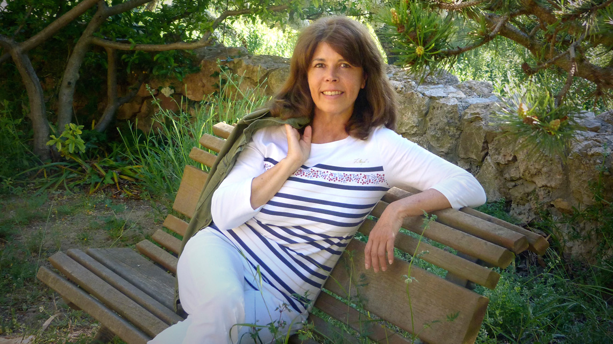

### Belmonte, María - ¿Fecha nacimientro? - Española (Bilbao)
       
María Belmonte Barrenechea nació en Bilbao. Es doctora en Antropología, ejerce de traductora e intérprete. Vive en Cataluña, en una zona de vides frente al Mediterráneo. “Peregrinos de la belleza. Viajeros por Italia y Grecia” es su primer libro. Ha tardado en escribirlo casi una década. Rememora a nueve escritores que han sido sus mentores en el descubrimiento del Mediterráneo y la cultura grecorromana. Se ha metido en su piel e incluso ha seguido sus pasos. Con la excusa de su escritura, se ha pegado unos inolvidables periplos por Italia y Grecia.

María Belmonte Barrenechea se ha bañado en los lugares del Mediterráneo donde lo hacían sus queridos escritores, ha tomado vino en sus tabernas y ha caminado por sus mismos senderos.

María es montañera y le encanta viajar a pie. Uno de sus personajes es Patrick Leigh Fermor, que cruzó Europa a pie con 18 años desde Holanda hasta Costantinopla, en la actualidad Estambul. Inició su ruta en diciembre de 1933, cuando Hitler acababa de llegar al poder en Alemania, en el momento que desaparecía la vieja Europa. Tras la experiencia, escribió una trilogía: “El tiempo de los regalos”, “Entre los bosques y el agua” y “El último tramo”. María siguió sus pasos desde Esparta a Kardamili, atravesando la cordillera de Taigeto. Le parecieron las montañas más solitarias de toda Grecia. Fueron tres días de caminata envuelta por la magia de la soledad y el misterio de un lugar cargado de historia. María llegó, incluso, a ver en varias ocasiones a Patrick antes de su muerte en 2011.

La trayectoria de María Belmonte como amante del Mediterráneo comenzó con 9 años cuando adquirió “Mitología griega y romana” de Hermann Steuding. Ya de adolescente, en París se enamoró del sonido de la lengua griega moderna. Otro hito importante como mediterraneófila fue su primer viaje a Florencia. En la plaza del Duomo comenzó a llorar pues nunca antes había sentido tanta felicidad ante tanta belleza.

A lo largo de los años, fruto de lecturas y búsquedas incesantes, fue conociendo a los personajes que aparecen en “Peregrinos de la belleza”. Ellos han guiado sus pasos por el Mediterráneo. Ha visitado las islas griegas de la mano de Larry Durrell, subido al monte Olimpo siguiendo a Kevin Andrews, ha conocido los secretos de Capri gracias a Axel Munthe, médico sueco que tenía su casa ante una vistas de ensueño mediterráneo…. De manera que María Belmonte se convierte en un personaje más del libro, es una peregrina de la exaltación, del entusiasmo y las ganas de vivir que transmite el Mediterráneo.

Maria Belmonte Barrenechea ha intervenido en el programa de Radio Euskadi “La Casa de la Palabra” el miércoles 10 de febrero de 2016.
***