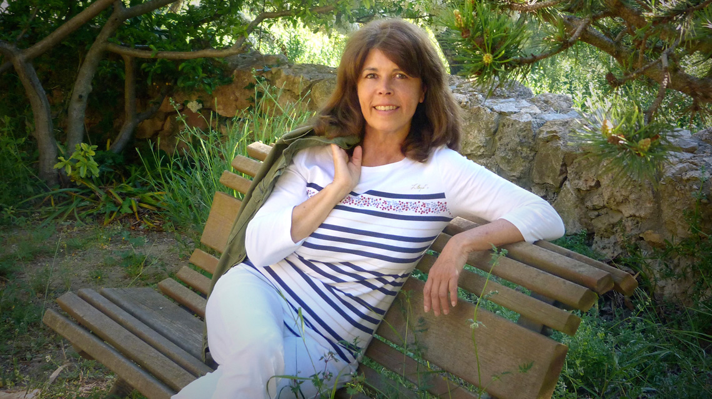
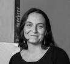
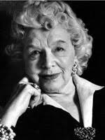

***
### Belmonte, María - ¿Fecha nacimientro? - Española (Bilbao)

Conoce quién es [Belmonte, María] (../BelmonteMaria.jpg/)
***
## Balló, Tania - 1977 - Española (Barcelona)

Conoce quién es [Balló, Tania] (../BalloTania.jpg/)
***
## Haderlap, Maja - 1961 - Austriaca - Eisenkappel-Vellach

Conoce quién es [Hadjadj, Fabrice] (../HaderlapMaja.jpg/)
***
### Hadjadj, Fabrice - 1971 - Francés - Nanterre

Conoce quién es [Hadjadj, Fabrice] (../HadjadjFabrice/)
***
### Lehman, Rosamond - 1901 - Inglesa - Bourne End

Conoce quién es [Lehmann, Rosamons] (../LehmannRosamond/)
***
### O'Farrel, Maggie - 1972 - Irlandesa - Coleraine 

Conoce quién es [O'Farrel, Maggie] (../OFarrelMaggie/)
***
### Stern, Richard - 1928 - Estadounidense - Nueva York 
  
Conoce quién es [Stern, Richard] (../SternRichard/)
***
### Valgañón, Elvira - 1977 - Española - Logroño        
                            
Conoce quién es [Valgañón, Elvira] (../ValgañónElvira/)
***
### Ward, Jesmyn - 1977 - Estadounidense
       
Conoce quién es [Ward, Jesmyn] (../WardJesmyn/)
***
### Zgustová, Monika - 1957 - Checo-Española (Praga)
       
Conoce quién es [Ward, Jesmyn] (../ZgustovaMonika/)
***