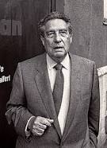

***
### Paz, Octavio - 1914 - Mexicano - México D.F.

Octavio Paz Lozano. (México D.F., 31 de marzo de 1914 - Coyoacán, México, 19 de abril de 1998). Poeta y ensayista mexicano. Premio Nobel de Literatura en 1990.

A los diecisiete años publica sus primeros poemas en la revista Barandal (1931). Posteriormente dirige las revistas Taller (1939) e Hijo pródigo (1943). En un viaje a España contacta con intelectuales de la república española y con Pablo Neruda, contactos que le influencian fuertemente en su poética.

Después de publicar Luna Silvestre (1933) y el poemario dedicado a la guerra civil española ¡No pasarán! (1936), edita Raíz del hombre (1937), Bajo tu clara sombra (1937), Entre la piedra y la flor (1941) y A la orilla del mundo (1942).

En 1944, con una beca Guggenheim, pasa un año en Estados Unidos. En 1945 entra en el Servicio Exterior Mexicano y es enviado a París. Durante este periodo se aleja del marxismo al entrar en contacto con los poetas surrealistas y otros intelectuales europeos e hipanoamericanos.

Llegando a la década de 1950 publica cuatro libros fundamentales: Libertad bajo palabra (1949),El laberinto de la soledad (1950), retrato de la sociedad mexicana, ¿Águila o sol? (1951), libro de prosa de influencia surrealista, y El arco y la lira (1956). 

Su obra, extensa y variada, se completa con numerosos poemarios y libros ensayísticos, entre los cuales cabe citar Cuadrivio (1965), Ladera este (1968), Toponemas (1969), Discos visuales (1969), El signo y el garabato (1973), Mono gramático (1974), Pasado en claro (1975), Sombras de obras (1983) y La llama doble (1993).

En 1981 es galardonado con el Premio Cervantes. En 1999 aparecen, póstumamente, Figuras y figuraciones y Memorias y palabras, epistolario entre Octavio Paz y Pere Gimferrer entre los años 1966 y 1997.
***