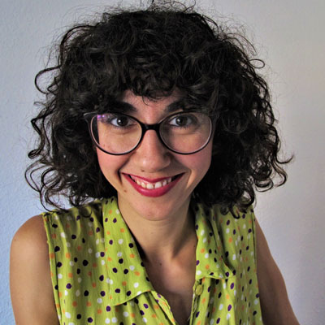

***
### Bautista, María - 1982 - Española (Salamanca)
       
María Bautista es hija y nieta de maestros, creció en la ciudad de Alcalá de Henares y estudió Periodismo en la Universidad Complutense de Madrid. En 2010 recibe el accésit en la modalidad infantil de la XIII Edición de los Premios de Cuentos Ilustrados de la Diputación de Badajoz con la obra Palabra de árbol. Desde ese momento se embarca, junto a la ilustradora Raquel Bonita, en el proyecto literario y editorial Cuento a la vista, con el que ha publicado Cuentos diferentes para niños diferentes (2013), Las ciudades de colores (2013) y Cuentos para leer con los abuelos (2014). En 2018 aparece su última publicación infantil hasta el momento: Moussa sueña (Bookolia). En 2013 emigra a Berlín, donde reside desde entonces. Bajo la higuera es su primera novela.

Escritora de literatura infantil, María formó junto a la ilustradora de este álbum, Raquel Bonita, Cuento a la vista, un proyecto editorial que aunaba cuentacuentos y actividades de animación a la lectura. Ha publicado “Cuentos diferentes para niños diferentes” (Cuento a la vista, 2013), “Las ciudades de colores” (Cuento a la vista, 2013), “Cuentos para leer con abuelos y las abuelas” (Cuento a la vista, 2014) y “Palabra de árbol” (Cuento a la vista 2014) que fue Accésit Modalidad Infantil – XIII Edición del Premio de Cuentos Ilustrados de la Diputación de Badajoz. Actualmente vive en Berlín y compagina su actividad literaria con talleres para público infantil y actividades teatrales para adultos.
***