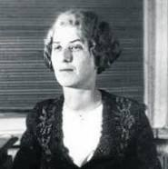

### Chukovskavia, Lidia - 24/03/1907 - Rusa (San Petersburgo)
       
Hija de María Borísovna Goldfeld y del escritor para niños, traductor y crítico Kornéi Chukovski. Fue esposa del físico Matvéi Bronstein detenido en 1937 y ejecutado en 1938. Las principales obras de Chukóvskaia son la novela Sofia Petrovna (1939-1940, publicada en el extranjero en 1965 con el título de Casa vacía y en la URSS en 1988: no pudo publicarse en su país hasta cincuenta años después.1​ El libro fue traducido al español por Marta Rebón e Inmersión. La heroína de la primera novela es una mujer sencilla, incapaz de comprender la naturaleza del terror que la rodea, que tras la detención de su hijo poco a poco se vuelve loca. Sofia Petrovna es la única obra literaria de prosa conocida hasta la fecha dedicada al Gran Terror de 1937-1938, que se escribió inmediatamente después de esos acontecimientos. La segunda novela es en parte de naturaleza autobiográfica y describe el comportamiento conformista de los escritores soviéticos en febrero de 1949 en medio de la lucha contra el cosmopolitismo. Primera galardonada en 1990 del Premio Andréi Sájarov, para el valor cívico de la escritora.
***