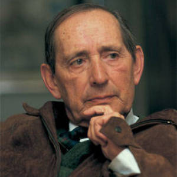

### Delibes, Miguel - 17/10/1920 - España (Valladolid)
       
Fue el tercero de los ocho hijos del matrimonio entre María Setién y Adolfo Delibes. Su padre, que fue catedrático de Derecho en la Escuela de Comercio de Valladolid,​ nació y murió en el municipio cántabro de Molledo, donde Miguel pasó numerosos veranos y del que fue nombrado hijo adoptivo en 2009. El apellido Delibes, de origen occitano-francés, provenía de Toulouse; el abuelo paterno de Miguel, sobrino del compositor francés Léo Delibes, se había desplazado a España para participar en la construcción del ferrocarril en Cantabria.9​ Su abuelo materno, Miguel María de Setién, fue un destacado abogado y político carlista originario de Limpias.

Cursó sus estudios en el Colegio de Lourdes, donde terminó el bachillerato en 1936. Tras estallar la guerra civil española, se enroló como voluntario en la Marina del Ejército sublevado en 1938. Como voluntario, prestó servicio en el crucero Canarias, que realizaba sus operaciones en la zona de Mallorca. En 1939, al concluir la contienda, regresó a su ciudad natal e ingresó en la Escuela de Comercio. Tras finalizar esta carrera, inició la de Derecho y se matriculó en la Escuela de Artes y Oficios de Valladolid, lo que le sirvió para mejorar sus dotes artísticas y ser contratado en 1941 como caricaturista en El Norte de Castilla, el diario vallisoletano por excelencia y escribía las críticas cinematográficas mientras continuaba realizando caricaturas. En 1942 obtuvo el título de Intendente Mercantil -actual licenciatura- por la Escuela de Altos Estudios Mercantiles de Bilbao,​ y al año siguiente, obtuvo la cátedra de Derecho mercantil, por lo que comenzó a impartir clases en la Escuela de Comercio de Valladolid. El 23 de abril de 1946 contrajo matrimonio con Ángeles de Castro, quien posteriormente se convirtió en una de sus mayores inspiraciones literarias. Su viaje de novios transcurrió en Molledo.
***