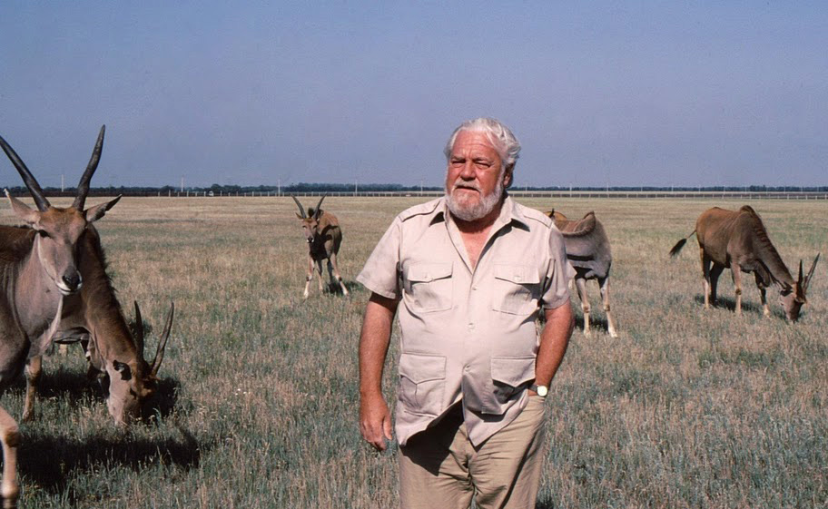

***
### Durrell, Gerald - 1925 - Britanico - Jamshedpur, Raj Británico

Durrell nació en Jamshedpur, entonces provincia de Bihar, en la India el 7 de enero de 1925. Sus padres habían nacido también en la India, aunque eran de ascendencia irlandesa (la madre) y británica (el padre). Fue el cuarto hijo (y el menor) de Louisa Durrell (nacida Dixie) y Lawrence Samuel Durrell. Sus otros hermanos fueron, en orden de edad, Larry, Leslie y Margo.

De su estancia en la India, Durrell recuerda principalmente su primera visita a un zoo, a la que atribuye su posterior pasión por los animales. Tras la muerte del padre de Gerald en 1928, la madre, Gerald y sus tres hermanos se mudaron a Bournemouth, Inglaterra.

La familia se trasladó de nuevo a la isla griega de Corfú en 1935, donde Durrell empezó a capturar y coleccionar especímenes de la fauna local como mascotas. Permanecieron en la isla hasta 1939. Este intervalo de tiempo sería más tarde la base para la Trilogía de Corfú iniciada por Mi familia y otros animales y sus secuelas, Bichos y demás parientes y El jardín de los dioses, además de varias historias cortas.

Durrell no asistió a la escuela durante su estancia en Corfú, sino que recibió sus enseñanzas de varios amigos de la familia y tutores privados, la mayoría amigos de su hermano mayor (y futuro novelista de éxito, Lawrence). Uno de ellos en especial, el griego-británico Theodore Stephanides, sería el mentor y amigo del joven Gerald. Doctor, científico, poeta y filósofo, las ideas de Stephanides, junto con los escritos del naturalista francés Jean Henri Fabre, dejaron una impresión imperecedera en el muchacho. Profesor y alumno capturaron, investigaron y examinaron las especies existentes entre la fauna de Corfú, usando desde tubos de ensayo hasta bañeras.

La familia volvió de nuevo a Inglaterra en 1939 con el estallido de la Segunda Guerra Mundial. A causa de lo difícil que resultaba durante la guerra y la posguerra encontrar un empleo, especialmente para un joven sin estudios formalizados, Durrell trabajó como ayudante en un acuario y una tienda de mascotas. Algunas memorias de ese periodo se pueden encontrar en su libro Filetes de lenguado.

Llamado a filas en el reemplazo de 1943, fue declarado exento del servicio por causas médicas, y posteriormente solicitó servir al esfuerzo de guerra trabajando en una granja. Tras la guerra, Durrell entró a trabajar en el Zoo de Whipsnade como becario. Con este empleo, cumplió con el sueño de su vida: Durrell afirmaba que la primera palabra que pronunció de pequeño fue zoo. Un zoológico en mi azotea relata sucesos de esa etapa.
***