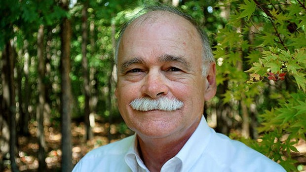

***
### Gautreaux, Tim - 1947 - Estadounidente - Morgan City, Louisiana

Timothy Martin Gautreaux
Sus escritos han aparecido en “The New Yorker”, Best American Short Stories, Atlantic, Harper's y GQ. Su novela The El próximo paso en el baile (Next Step in the Dance) ganó el premio SEBA Book Award 1999. Su novela "The Clearing" ganó el premio del libro SIBA de la Alianza de Libreros Independientes del Sur de 1999 y el Premio de la Asociación de Libreros Independientes del Medio Sur de 2003. También ganó el premio John Dos Passos 2005
Gautreaux también es autor de El mismo sitio, las mismas cosas (Same Place, Same Things) y Welding with Children, colecciones de cuentos. Su novela de 2009 "The Missing" fue descrita como "la mejor hasta ahora" por la editora de libros del New Orleans Times-Picayune, Susan Larson, en un artículo destacado.
Gautreaux señala que los antecedentes de su familia obrera han tenido una influencia significativa en su escritura. Su padre era capitán de remolcador y su abuelo era ingeniero de barcos de vapor. Dadas esas influencias, dice, "me enorgullezco de escribir una ficción de 'amplio espectro', una ficción que atrae tanto a intelectuales como a obreros. Muchas veces he escuchado historias de personas que no leen cuentos, o personas que tienen trabajos técnicos, a quienes les gusta mi ficción ".
Gautreaux también tiende a escribir por experiencia o por lo que sabe. Sostiene que un autor debe tener una buena comprensión o antecedentes sobre lo que pretende escribir, "acabo de aprender en el camino que la escritura proviene de la vida. La vida no proviene de la escritura. La mejor manera de aprender a escribir sobre niños es tener un par propio. Tienes que pasar por la lucha para criarlos.

Además, Gautreaux ha dejado claro que no le interesa ser clasificado como un "escritor sureño", prefiriendo en cambio decir que es un "escritor que vive en el sur". Se siente mucho más cómodo abrazando su catolicismo romano, diciendo: "Siempre he sido católico romano, desde el bautismo, desde que nací".
Gautreaux está casado con Winborne Howell Gautreaux. La pareja tiene dos hijos mayores: Robert Timothy Gautreaux y Thomas Martin Gautreaux. Viven en Chattanooga, Tennessee.
***