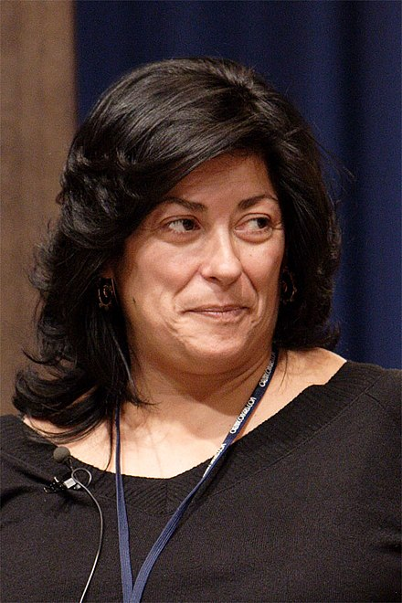

### Grandes, Almudena - 1960 - Española (Madrid)

Almudena Grandes (Madrid, 1960) se dio a conocer en 1989 con Las edades de Lulú, XI Premio La Sonrisa Vertical. Desde entonces el aplauso de los lectores y de la crítica no ha dejado de acompañarla. Sus novelas Te llamaré Viernes, Malena es un nombre de tango, Atlas de geografía humana, Los aires difíciles, Castillos de cartón, El corazón helado y Los besos en el pan, junto con los volúmenes de cuentos Modelos de mujer y Estaciones de paso, la han convertido en uno de los nombres más consolidados y de mayor proyección internacional de la literatura española contemporánea. Varias de sus obras han sido llevadas al cine, y han merecido, entre otros, el Premio de la Fundación Lara, el Premio ...

Desde pequeña quiso ser escritora, pero por voluntad de su madre —quien deseaba que se dedicase a una "carrera de chicas". ingresó en la Facultad de Geografía e Historia de la Universidad Complutense de Madrid, aunque, según confesión de la autora, hubiera preferido estudiar latín.​ Tras diplomarse, comenzó a trabajar escribiendo textos para enciclopedias. También hizo algún papel en el cine (A contratiempo, de Óscar Ladoire). Siendo hija y nieta de "escritores de poesía aficionados", la autora afirma que nunca se ha dedicado a otro género que no fuera el narrativo, exceptuando su obra dramática Atlas de geografía humana, género por el cual siente "una gran pasión y a la vez una gran frustración". La primera novela que publicó fue Las edades de Lulú (1989), obra erótica que ganó el XI Premio La Sonrisa Vertical y fue llevada al cine por Bigas Luna al año siguiente. El libro tuvo un gran éxito y ha sido traducido a más de 20 idiomas. El desmedido éxito de su primera novela, según declaraciones de la autora: "le regaló la vida que ella quería vivir y jamás podrá saldar esa deuda".

En cuanto al tema de la posguerra y la transición española, asuntos en torno a los que gira toda la obra de la autora, Grandes afirma que la cultura oficial que ha adquirido mayor difusión (respecto a la guerra civil y a la posguerra españolas) tiene mucho que ver con la versión silenciosa y evasiva que mantuvo la generación de "los abuelos", versión de la que se han alimentado las generaciones posteriores, según opina la autora, _ incapaces de comprender en su totalidad la historia contemporánea española debido a este silencio generacional. Según declaraciones de la autora, el franquismo fue una dictadura prototípica debido a su certera aplicación progresiva del terror; se sembraba toda esa represión desde el gobierno para que nadie se moviera ni quisiera cambiar las cosas. La transición española fue exhibida como modélica en países de todo el mundo, especialmente en los de América Latina. En su opinión, desde el punto de vista institucional, la transición tuvo un éxito sin precedentes: introduciendo una democracia inédita y ejemplar; sólida y real. Sin embargo, partiendo desde un punto de vista moral, la autora opina que la transición, aún 30 años después de su implantación, ha resultado un fracaso en tanto a ideología para la generación sucesiva: "no reconociendo las reglas del juego establecidas en los años 70". A pesar de ello, Grandes coincide en que: “Esa generación (la de la transición) hizo honestamente lo que creía que tenía que hacer”.
***