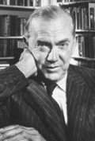

### Greene, Graham - 1904 Berkhamsted, Hertfordshire - (Inglaterra)

Greene nació en Berkhamsted, Hertfordshire, cuarto de los seis hijos que llegaron a tener Charles Henry Greene y Marion Raymond Greene, primos hermanos y miembros de una extensa e influyente familia a la que pertenecían los dueños de la licorería Greene King y varios banqueros y hombres de negocios. Su hermano menor, Hugh Greene, fue director General de la BBC, y el mayor Raymond Greene un eminente doctor y alpinista. Como ascendientes literarios cabe mencionar que su madre era prima del gran escritor escocés Robert Louis Stevenson; por su parte, Charles Greene era subdirector del mismo colegio de Berkhamsted que dirigía el doctor Thomas Fry, casado con una prima suya.

En 1910 Charles Greene sucedió al doctor Fry como director del colegio y Graham, que era alumno interno, sufrió el acoso de los otros alumnos por ser hijo del director. Maltratado y profundamente deprimido, intentó suicidarse varias veces, algunas de ellas, según comentó él mismo, por el procedimiento de la ruleta rusa. Por ello, en 1921, con apenas 17 años, se sometió durante seis meses a psicoanálisis en Londres a fin de lidiar con su melancolía; fueron para él, según una biografía de Joseph Pearce, los mejores seis meses de su vida. Tras eso regresó al colegio pero no al internado y vivió con su familia. Entre sus compañeros de colegio estaban el periodista Claud Cockburn y el historiador Peter Quennell. De aquella época le quedó una depresión intermitente.

Con diecinueve años militó durante unas semanas (1922), en el Partido Comunista de la Gran Bretaña, lo que a la postre le valió restricciones para entrar en EE.UU hasta que fue elegido presidente John Kennedy. Fue al Balliol College en Oxford, donde pasó bastante desapercibido y se licenció en historia; su compañero, el novelista Evelyn Waugh, recordó entonces que "a Graham Greene le parecíamos fatuos y pueriles. Nunca participó en nuestras juergas universitarias". Su primer trabajo, un volumen de poesía titulado Babbling April se publicó en 1925, siendo aún estudiante, pero no fue muy bien acogido por la crítica.
***