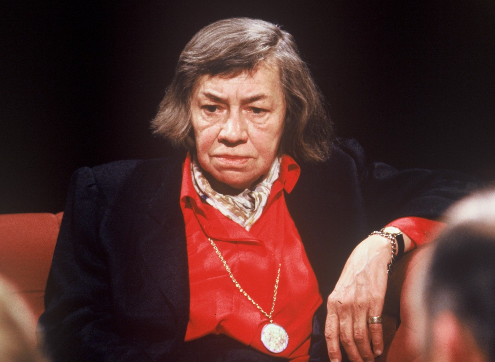

***
### Highsmith, Patricia - 1921 - Estados Unidos - Fort Worth, Texas

Sus padres, Jay Bernard Plangman y Mary Coates, se divorciaron antes de que naciera. Por eso, no conoció a su padre hasta cumplir los doce años. Durante los primeros años de su vida, fue educada por su abuela materna, Willi Mae, en Texas.

En 1924 su madre contrajo matrimonio con Stanley Highsmith, del que Patricia tomó el apellido.4​ En 1927 se marchó a vivir a Nueva York con ellos, donde trabajaban como diseñadores gráficos. Patricia mantuvo siempre una relación complicada con ellos. Según confesaba, su madre intentó abortar bebiendo aguarrás, durante su embarazo. Highsmith nunca superó esta relación de amor y odio con su madre. Tanto así que le inspiró para escribir "The Terrapin," en el que un joven apuñala a su madre.

Fue una lectora voraz. Le interesaban temas relacionados con la culpa, la mentira y el crimen, que más adelante fueron los temas centrales en su obra. A los ocho años descubrió el libro de Karl Menninger La mente humana y quedó fascinada por los casos que describía de pacientes afligidos por enfermedades mentales. Los análisis de este autor sobre las conductas anormales influyeron en su percepción de los personajes literarios. Tuvo una temprana vocación por la escritura y en 1935 escribió su primer relato, que no se ha conservado. Empezó a escribir gruesos volúmenes desde los 16 años hasta su muerte con ideas sobre relatos y novelas, así como diarios. Todo este material se conserva en los Archivos Literarios Suizos, en Berna.

Se graduó en 1942 en el Barnard College, donde estudió literatura inglesa, latín y griego.​ Mientras vivía en la ciudad de Nueva York y México entre 1942 y 1948, antes de publicar sus primeros cuentos, Highsmith escribió para editoriales de cómics. Comenzó en la editorial Ned Pines escribiendo dos historias de cómics al día por 55 dólares a la semana para más tarde pasar a una etapa como autora independiente, situación que le permitió encontrar tiempo para trabajar en sus propias historias cortas. El trabajo de guionista de cómics fue el único empleo a largo plazo que tuvo Highsmith. En 1943 empezó a trabajar para la editorial Fawcett haciendo sinopsis de cómics y en esa época descubre su homosexualidad, tema que tratará más adelante cuando en 1952 aparezca bajo el pseudónimo de Claire Morgan su novela El precio de la sal. Trata de la problemática historia de amor entre dos mujeres, con un final feliz insólito para la época. Treinta y tantos años después la reimprimió con el título de Carol y descubriendo que era ella la verdadera autora, revelando en su epílogo las comprensibles razones del anonimato inicial. Finalizaba con estas palabras: «Me alegra pensar que este libro le dio a miles de personas solitarias y asustadas algo en que apoyarse».

A los 22 años comenzó a escribir su primera novela The click of the shutting, nunca publicada.​ En 1945, tras una breve estancia en México de cinco meses, surgieron los cuentos En la Plaza, escrito en Taxco, estado de Guerrero, y El coche. Publicó su primer cuento a los 24 años en la revista Harper´s Bazaar. En 1950 publica su primera novela, Extraños en un tren, por la que saltó a la fama un año después con la adaptación al cine de Alfred Hitchcock.

El pesimismo de sus historias, su exclusión de todo sentimentalismo y la crueldad materialista de sus análisis éticos fueron mal acogidos en Estados Unidos, pero no en Europa, y como sus ideas políticas de sesgo comunista contrariaban al american way of life,​ abandonó el Nuevo Mundo y se trasladó para siempre a Europa en 1963. Residió en East Anglia (Reino Unido) y en Francia, y sus últimos años los pasó en Tegna al oeste de Locarno (Suiza), donde falleció.
***