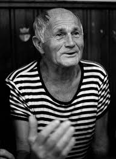

***
### Hrabal, Bohumil - 1914 - Checo - Praga

Bohumil Hrabal estudió derecho en la Universidad Carolina de Praga, teniendo que interrumpir sus estudios a causa de la ocupación nazi de Checoslovaquia. Trabajó como empleado ferroviario durante la Segunda Guerra Mundial y luego fue tramoyista, cartero y obrero metalúrgico; también trabajó en una planta de reciclaje de papel de libros censurados. Aunque a finales de la década de 1940 había comenzado a escribir tanto poesía como relatos cortos,​ Hrabal fue un escritor tardío, pues no sería hasta 1963 (a punto de cumplir su medio siglo de vida) cuando publicó su primer libro Skřivánci na niti (Alondras en el alambre).

Durante los años setenta, en la denominada «época de normalización» en la Checoslovaquia comunista, el autor fue represaliado pese a no ser uno de los firmantes de la «Carta 77», siendo expulsado de la Asociación de Escritores Checos y retirándose su obra de librerías y bibliotecas. Hrabal se vio obligado a publicar sus textos de forma ocasional en tiradas reducidas, en lo que se conoció como ediciones «samizdat», cuando sus novelas anteriores siempre habían agotado sus tiradas poco después de ponerse a la venta.

Pese a su fama, el escritor checo se mantuvo alejado de la vida social, y gustaba de entretener su ocio en su habitual cervecería praguense. Bohumil Hrabal murió a los 83 años de edad tras caerse de un quinto piso, y todavía se mantiene el debate de si fue accidental o se trató de un suicidio.
***