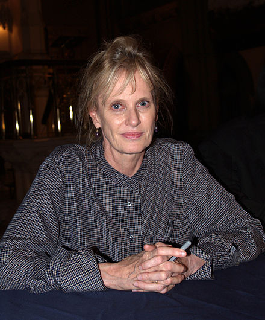

***
### Hustvedt, Siri - 1955 - Estadounidense - Minnesota
  
Realizó sus estudios de licenciatura en St. Olaf College (Historia) y su doctorado en la Universidad de Columbia (Inglés). Su tesis doctoral es acerca de la obra de Charles Dickens y se titula Figures of Dust. A Reading of "Our Mutual Friend".
Hustvedt se ha destacado principalmente como novelista pero también ha publicado un libro de poesía, al igual que cuentos y ensayos interdisciplinarios en The Art of the Essay 1999, Best American Short Stories 1990 y 1991, The Paris Review, The Yale Review y la revista Modern Painters, entre otros.
En octubre de 2012, fue galardonada con el Premio Internacional Gabarrón de Pensamiento y Humanidades 2012, gracias a su labor investigadora y sus ideas sobre filosofía, neurociencia o psicología.
En 2014, recibió un doctorado honoris causa por la Universidad de Oslo.3​ También ha sido nombrada doctora honoris causa por la Universidad Stendhal-Grenoble en Francia, el 20 de octubre de 2015 y por la Universidad de Gutenberg-Mainz en Alemania, el 16 de junio de 2016.
En mayo de 2019 fue galardonada con el Premio Princesa de Asturias de las Letras 2019, por toda una obra sustentada en el feminismo, arte y ciencia.

Vida personal
Vive en Brooklyn, Nueva York, con su marido el novelista Paul Auster y la hija que tienen en común, la cantante Sophie Auster.[cita requerida]

Siri Hustvedt, nacida en Minnesota, de padres no­ruegos, vive en Brooklyn, Nueva York. Después de novelas y ensayos publicados en España por Circe, su tercera novela, Todo cuanto amé, publicada en España por Circe y en América Latina por Anagrama, supuso su consagración internacional: «La novela más ambiciosa y más gratificante de Siri Hustvedt. Fascina, apasiona e inquieta» (Salman Rushdie)
«La coloca entre lo mejor de la literatura norteamericana» (Miguel Russo, Revista Veintitrés, Buenos Aires)
«Un claro exponente de la habilidad narrativa de Siri Hustvedt. Una autora que, sin duda, tiene todavía mucho que decirnos» (J. A. Gurpegui, El Cultural).
En Anagrama ha publicado después Elegía para un americano: «La consagración de Siri Hustvedt. Me atrevo a vaticinar que será uno de los libros del año» (Robert Saladrigas, La Vanguardia)
«Una novela excepcional» (Juan Manuel de Prada, ABC)
«La elegancia de la transparencia del método Hustvedt confiere a la novela una dimensión etérea, ligerísima» (Sergi Sánchez, El Periódico
así como La mujer temblorosa: «Siri Hustvedt, una de nuestras mejores novelistas, es desde hace mucho tiempo una brillante exploradora del cerebro y de la mente. Un libro erudito, fascinante, que hace que la relación entre mente y cuerpo nos asombre aún más» (Oliver Sacks).
***