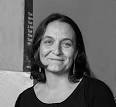
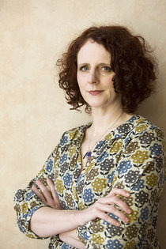
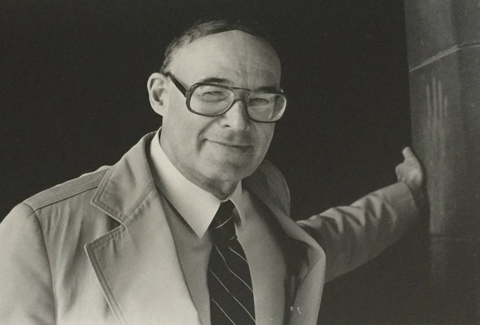

***
## Balló, Tania - 1977 - Española (Barcelona)

Conoce quién es [Balló, Tania] (zangolotinos/content/pages/99999999--Autores/BalloTania)
***
### Belmonte, María - ¿Fecha nacimientro? - Española (Bilbao)

Conoce quién es [Belmonte, María] (zangolotinos/content/pages/99999999--Autores/BelmonteMaria)
***
## Haderlap, Maja - 1961 - Austriaca - Eisenkappel-Vellach

Conoce quién es [Haderlap, Maja] (zangolotinos/content/pages/99999999--Autores/HaderlapMaja)
***
### Hadjadj, Fabrice - 1971 - Francés - Nanterre

Conoce quién es [Hadjadj, Fabrice] (zangolotinos/content/pages/99999999--Autores/HadjadjFabrice)
***
### Landero, Luis - 1948 - Español - Alburquerque (Badajoz)

Conoce quién es [Landero, Luis] (zangolotinos/content/pages/99999999--Autores/LanderoLuis)
***
### Lehman, Rosamond - 1901 - Inglesa - Bourne End

Conoce quién es [Lehmann, Rosamons] (zangolotinos/content/pages/99999999--Autores/LehmannRosamond)
***
### Littell, Jonathan - 1967 - Estadounidense - Nueva York

Conoce quién es [Lehmann, Rosamons] (zangolotinos/content/pages/99999999--Autores/LittellJonathan)
***
### Mankell, Henning - 1948 - Suecia - Estocolmo

Conoce quién es [Mankell, Henning] (zangolotinos/content/pages/99999999--Autores/MankellHenning)
***
### Paz, Octavio - 1914 - Mexicano - México D.F.

Conoce quién es [Paz, Octavio] (zangolotinos/content/pages/99999999--Autores/PazOctavio)
***
### O'Farrel, Maggie - 1972 - Irlandesa - Coleraine 

Conoce quién es [O'Farrel, Maggie] (zangolotinos/content/pages/99999999--Autores/OFarrelMaggie)
***
### Stern, Richard - 1928 - Estadounidense - Nueva York 
  
Conoce quién es [Stern, Richard] (zangolotinos/content/pages/99999999--Autores/SternRichard)
***
### Valgañón, Elvira - 1977 - Española - Logroño        
                            
Conoce quién es [Valgañón, Elvira] (zangolotinos/content/pages/99999999--Autores/ValgañónElvira)
***
### Zgustová, Monika - 1957 - Checo-Española (Praga)
       
Conoce quién es [Ward, Jesmyn] (zangolotinos/content/pages/99999999--Autores/ZgustovaMonika)
***
### Ward, Jesmyn - 1977 - Estadounidense
       
Conoce quién es [Ward, Jesmyn] (zangolotinos/content/pages/99999999--Autores/WardJesmyn)
***