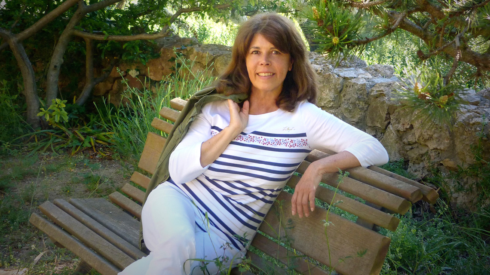
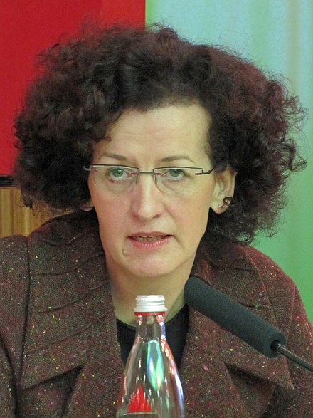
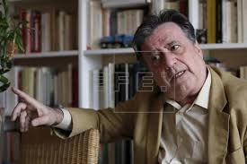
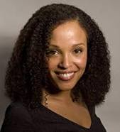

***
## Balló, Tania - 1977 - Española (Barcelona)

Conoce quién es [Balló, Tania] (Content/Pages/Autores/BalloTania/)
***
### Belmonte, María - ¿Fecha nacimientro? - Española (Bilbao)

Conoce quién es [Belmonte, María] (Content/Pages/Autores/BelmonteMaria/)
***
## Haderlap, Maja - 1961 - Austriaca - Eisenkappel-Vellach

Conoce quién es [Haderlap, Maja] (Content/Pages/Autores/HaderlapMaja/)
***
### Hadjadj, Fabrice - 1971 - Francés - Nanterre

Conoce quién es [Hadjadj, Fabrice] (Content/Pages/Autores/HadjadjFabrice/)
***
### Landero, Luis - 1948 - Español - Alburquerque (Badajoz)

Conoce quién es [Landero, Luis] (Content/Pages/Autores/LanderoLuis/)
***
### Lehman, Rosamond - 1901 - Inglesa - Bourne End

Conoce quién es [Lehmann, Rosamons] (Content/Pages/Autores/LehmannRosamond/)
***
### Littell, Jonathan - 1967 - Estadounidense - Nueva York

Conoce quién es [Lehmann, Rosamons] (Content/Pages/Autores/LittellJonathan/)
***
### Mankell, Henning - 1948 - Suecia - Estocolmo

Conoce quién es [Mankell, Henning] (Content/Pages/Autores/MankellHenning/)
***
### Paz, Octavio - 1914 - Mexicano - México D.F.

Conoce quién es [Paz, Octavio] (Content/Pages/Autores/PazOctavio/)
***
### O'Farrel, Maggie - 1972 - Irlandesa - Coleraine 

Conoce quién es [O'Farrel, Maggie] (Content/Pages/Autores/OFarrelMaggie/)
***
### Stern, Richard - 1928 - Estadounidense - Nueva York 
  
Conoce quién es [Stern, Richard] (Content/Pages/Autores/SternRichard/)
***
### Valgañón, Elvira - 1977 - Española - Logroño        
                            
Conoce quién es [Valgañón, Elvira] (Content/Pages/Autores/ValgañónElvira/)
***
### Zgustová, Monika - 1957 - Checo-Española (Praga)
       
Conoce quién es [Ward, Jesmyn] (Content/Pages/Autores/ZgustovaMonika/)
***
### Ward, Jesmyn - 1977 - Estadounidense
       
Conoce quién es [Ward, Jesmyn] (Content/Pages/Autores/WardJesmyn/)
***