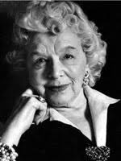

***
### Lehmann, Rosamond - 1901 - Inglesa - Bourne End

Rosamond Lehmann nació en Bourne End, Buckinghamshire, La segunda de cuatro hijos de Rudolph Chambers Lehmann (1856–1929) y su esposa estadounidense, Alice Mary Davis (1873–1956), de Nueva Inglaterra. El padre de Rosamond fue un diputado liberal, fundador de la revista Granta y editor de Daily News. Su hermana mayor era Helen Chambers Lehmann (1899–1985), y su hermana menor era la actriz Beatrix Lehmann (1903–1979). Su hermano menor era John Lehmann (1907–1989), el escritor y editor. El dramaturgo estadounidense Owen Davis era su primo, y su bisabuelo Robert Chambers fundó el Diccionario Chambers. Su tío abuelo fue el artista Rudolf Lehmann.
Educada en casa, en 1919 ganó una beca para Girton College, Cambridge. Se graduó con un título de segunda clase en literatura inglesa (1921) y lenguas modernas y medievales (1922). En diciembre de 1923 se casó con Walter Leslie Runciman (más tarde 2do vizconde Runciman de Doxford) (1900–1989), y la pareja se fue a vivir a Newcastle upon Tyne. Fue un matrimonio infeliz: se separaron en 1927 y se divorciaron más tarde ese año.
En 1927, Lehmann publicó su primera novela, Dusty Answer, con gran éxito de crítica y popularidad. La heroína de la novela, Judith, se siente atraída por hombres y mujeres, e interactúa con personajes bastante abiertamente gays y lesbianas durante sus años en Cambridge. La novela fue un suceso de escándalo. Aunque ninguna de sus últimas novelas tuvo tanto éxito como la primera, Lehmann publicó seis más, además de una obra de teatro (No More Music, 1939), una colección de cuentos (The Gypsy's Baby & Other Stories, 1946), una autobiografía espiritual (The Swan in the Evening, 1967), y una memoria fotográfica de sus amigos (Rosamond Lehmann's Album, 1985), muchos de los cuales eran figuras famosas del Grupo Bloomsbury como Leonard y Virginia Woolf, Dora Carrington y Lytton Strachey. También tradujo dos novelas francesas al inglés: Genevieve de Jacques Lemarchand (1948) y The Holy Terrors de Jean Cocteau (1955). Sus novelas incluyen Una nota en la música (1930), Invitación al vals (1932), El clima en las calles (1936), La balada y la fuente (1944), La arboleda que se hace eco (1953) y Un árbol de mar y uva. (1976).
En 1928, Lehmann se casó con Wogan Philipps, un artista que más tarde sucedió a su padre como Wogan Philipps, 2do Barón Milford. Tuvieron dos hijos, un hijo Hugo (1929–1999) y una hija Sarah, también conocida como Sally (1934–1958). La familia vivió en la casa de Ipsden en Oxfordshire entre 1930 y 1939. El matrimonio se derrumbó a finales de los años treinta y su esposo se marchó para participar en la Guerra Civil Española. Durante la Segunda Guerra Mundial, Lehmann ayudó a editar y también contribuyó a New Writing,una publicación periódica editada por su hermano John Lehmann. Tuvo un romance con el periodista Goronwy Rees y luego un "romance muy público" durante nueve años (1941-1950) con el poeta casado Cecil Day-Lewis, quien finalmente la dejó para casarse con su segunda esposa, Jill Balcon.
Una opositora activa del fascismo, Lehmann habló en reuniones antifascistas en 1938 en París y Londres.
The Swan in the Evening (1967) es una autobiografía que Lehmann describió como su "Último Testamento". En ella, describe íntimamente las emociones que sintió al nacer a su hija Sally, y también cuando Sally murió repentinamente de poliomielitis a la edad de 23 (o 24 años) en 1958 mientras estaba en Yakarta, Indonesia. Nunca se recuperó de la muerte de Sally y afirmó haber tenido experiencias psíquicas relacionadas con Sally, que se documentaron en Momentos de la verdad. Las colecciones de cartas de 'más allá de la tumba' supuestamente dictadas por Sally se publicaron en forma de panfleto junto con las de la hija de Lady Cynthia Sandys, Patricia, que también había muerto joven. Sandys afirmó haber recibido las cartas como "dictado" de la otra vida. Algunas de estas cartas también aparecieron en forma de libro en una antología de escritos similares, The Awakening Letters, coeditado por Lehmann.
Lehmann fue nombrada CBE en 1982. Casi ciega de cataratas, murió en su casa en Clareville Grove, Londres, el 12 de marzo de 1990, a los 89 años.
***