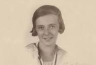

***
### Lunguiná, Lilianna - 1920 - Rusa - Moscú

Lilianna Lunguiná (Smolensk, 1920 – Moscú, 1998) fue una importante traductora al ruso de obras en alemán, francés, noruego, sueco y danés durante la época soviética. Entre otros, tradujo a Astrid Lindgren, August Strindberg, Henrik Ibsen, Heinrich Böll, Michael Ende, Colette, Friedrich Schiller, Christian Andersen, Boris Vian, Knut Hamsun y Romain Gary. En estas memorias literarias narradas a Oleg Dorman —publicadas por primera vez en español— con el título de Versión original (Automática Editorial), Lunguiná no solo recupera y reivindica su figura y su trabajo, sino que además constituye en sí mismo un documento histórico único, ya que su relato permite adentrarnos en la cotidianidad de la vida bajo el régimen soviético, y es, también, una crónica narrada por una mujer que perteneció a los círculos intelectuales de la época (conoció a Pasternak, Brodsky y Solzhenitsyn, entre muchas otras figuras de la literatura rusa del siglo XX), tanto al oficialista (fue miembro de la Unión de Escritores) como al paralelo (la resistencia que se creó frente a la rígida y censora postura cultural del régimen). Por eso Versión original es también una ventana al no tan conocido mundo literario ruso, su activismo y, sobre todo, sus persecuciones políticas. Como escribió Lilianna Lunguiná: «Mi trabajo de traductora literaria, pese a su carácter modesto, sí que ayudaba a crear agujeros en el telón de acero que nos separaba del resto del mundo. Después de todo, quien ha leído a Boris Vian o a Colette ve el mundo con otros ojos».
***