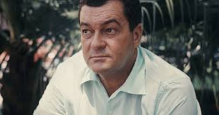

***
### Mauro de Vasconcelos, José - 1920 - Brasil - Rio de Janeiro

Fue un novelista brasileño, autor de obras destacadas como Mi planta de naranja lima (1968), Rosinha, mi canoa (1962) y Vamos a calentar el sol (1974).

Nació en el barrio carioca de Bangu, en Brasil, mestizo de madre indígena y padre portugués. Debido a la pobreza de su familia, de niño se trasladó a vivir con unos primos en Natal, capital de Río Grande del Norte. Los raros cambios y experiencias que sufrió durante su niñez sirvieron como base temática de Mi planta de naranja lima, su libro más popular. En esa misma ciudad, cursó dos años de la carrera de Medicina, pero abandonó los estudios para volver a Río de Janeiro.

Ejerció diversos empleos, que por lo general solo le permitían subsistir. Entre otras muchas ocupaciones, fue entrenador de boxeo, cargador de bananas en una fazenda del litoral fluminense, modelo de escultores en la Escuela Nacional de Bellas Artes de Río (donde en 1941 fue modelo de Bruno Giorgi para su Monumento a la Juventud) o camarero en un local nocturno de São Paulo.

Gracias a una beca de estudios en España, tuvo ocasión de conocer varios países europeos. Posteriormente al regresar a Brasil, trabajó con los hermanos Villas-Bôas, explorando la cuenca del río Araguaia. De su contacto con los garimpeiros durante esta aventura provino la inspiración para su primer libro, Banana Brava, publicado en 1942 cuando tenía 22 años (editado como Hombres sin piedad en los países de habla hispana).​ En su novela Raya de fuego (Arraia de fogo, 1955) narra las dificultades del contacto con los indígenas en estas exploraciones.

José Mauro de Vasconcelos refleja en sus novelas una gran experiencia de vida, sensibilidad hacia los desposeídos y un profundo amor y respeto por la naturaleza. En ellas está presente la dureza de la vida en el sertón, la niñez en los barrios pobres, los peligros que enfrentan los indígenas en la selva ante la pérdida de su aislamiento y de su hábitat natural, regionalismos, en un lenguaje claro y directo.

Su primer éxito de crítica fue en 1948 con Barro blanco, novela ambientada en las salinas de Macau en Río Grande del Norte. Rosinha, mi canoa (1962) confirmó el favor del público hacia su trabajo. Pero fue con Mi planta de naranja lima (1968) que consiguió proyección internacional, logrando que esta obra sea una de las más difundidas de la literatura brasileña en todo el mundo. Este libro, en el que rememora su infancia en Bangu, forma parte de una tetralogía autobiográfica no ordenada cronológicamente, integrada por Vamos a calentar el sol (1974), sobre su traslado a Natal; Doidao (1963), sobre su adolescencia; y Las confesiones de Fray Calabaza (1966), sobre su vida adulta.

Varias de sus obras fueron adaptadas al cine, teatro y series televisivas (Vazante, Arara Vermelha, Rua Descalça, As Confissões de Frei Abóbora). Se realizaron varias versiones de Mi planta de naranja lima, siendo la dirigida por Aurelio Teixeira en 1970 la primera para el cine.​ Se realizaron tres telenovelas sobre el mismo libro: en 1970 para la Rede Tupi, y en 1980 y 1998 para la Rede Bandeirantes. En 2011 se presenta su segunda versión cinematográfica.

José Mauro de Vasconcelos también fue guionista, actor de teatro y de televisión, periodista y artista plástico. Falleció el 24 de julio de 1984 a los 64 años de edad en São Paulo a causa de bronconeumonía tras permanecer 20 días en estado de coma.
***