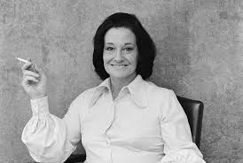

***
### Mortimer, Penelope - 1918 - Inglesa - Rhyl 

Penelope Ruth Mortimer fue una periodista, biógrafa y novelista inglesa nacida en Gales. Su novela semiautobiográfica El devorador de calabaza se adaptó en una película de 1964 por la que Anne Bancroft fue nominada para el Oscar a la mejor actriz por su papel de Jo Armitage, un personaje basado en la propia Mortimer.

Mortimer nació en Rhyl, Flintshire (ahora Denbighshire), Gales, la hija menor de Amy Caroline Fletcher y el reverendo A. F. G. Fletcher​, un clérigo anglicano, que había perdido su fe y usaba la revista parroquial para celebrar la persecución soviética de la iglesia rusa.​ Abusó sexualmente de ella.

Mortimer escribió más tarde sobre su padre: "Creo que se hizo clérigo por una sola razón; no había nada más -como el segundo hijo de Nellie Fletcher- que pudiera haber sido. De pequeño, intimidado y burlado por seis hermanas y cuatro hermanos, se sentó bajo la mesa de la guardería cantando:'Mamá, papá, todos los niños son desagradables excepto yo', al son de Gentle Jesus​"

Su padre cambiaba frecuentemente de parroquia y ella asistió a numerosas escuelas. Fue educada en todo el país, en la Croydon High School, la New School, Streatham, Blencathra, Rhyl, Garden School, Lane End, St Elphin's School for Daughters of the Clergy, y la Central Educational Bureau for Women. Dejó el University College, Londres​, después de un año.

Se casó con Charles Dimont, periodista, en 1937 y tuvieron dos hijas​, entre ellas la actriz Caroline Mortimer. También tuvo dos hijas de relaciones extramatrimoniales con Kenneth Harrison y Randall Swingler. Conoció al abogado y escritor John Mortimer cuando estaba embarazada del último hijo y se casó con él en 1949, el día en que su divorcio de Dimont se hizo firme. Junto tuvieron una hija y un hijo, Jeremy Mortimer. Su relación, que al principio fue muy feliz, pronto se volvió tormentosa​.

En los años 50 y 60, la pareja fue fotografiada con frecuencia en eventos de la alta sociedad londinense​ Sin embargo, detrás de esta fachada, Penélope tuvo frecuentes episodios de depresión. En 1962, el mismo año en que se escribió The Pumpkin Eater, aceptó un aborto y una esterilización a instancias de John Mortimer. Se dice que estaba contenta con la decisión, pero durante su convalecencia, descubrió el romance de su marido con Wendy Craig, por quien tuvo un hijo. Se divorciaron en 1971.
***