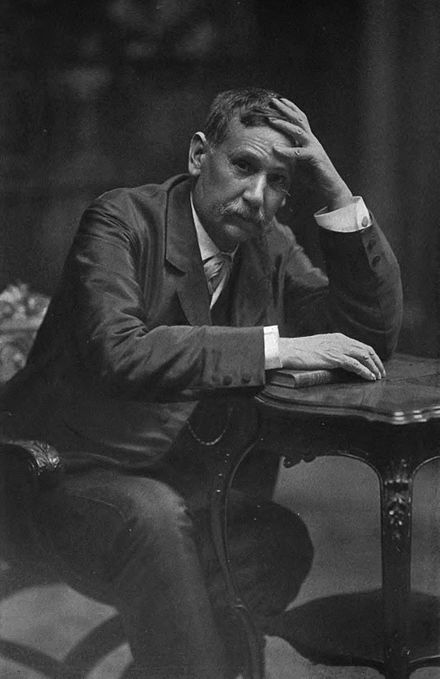

***
### Pérez Galdós, Benito - 1843 - Español - Las palmas de Gran Canaria

Fue un novelista, dramaturgo, cronista y político español.2
Se le considera uno de los mejores representantes de la novela realista del siglo XIX no solo en España y un narrador capital en la historia de la literatura en lengua española, hasta el punto de ser propuesto por varios especialistas y estudiosos de su obra como el mayor novelista español después de Cervantes.

Transformó el panorama novelesco español de la época, apartándose de la corriente romanticista en pos del naturalismo y aportando a la narrativa una gran expresividad y hondura psicológica.​ En palabras de Max Aub, Pérez Galdós, como Lope de Vega, asumió el espectáculo del pueblo llano y con «su intuición serena, profunda y total de la realidad», se lo devolvió, como Cervantes, rehecho, «artísticamente transformado». De ahí que «desde Lope ningún escritor fue tan popular, ninguno tan universal desde Cervantes».​

Fue académico de la Real Academia Española desde 1897 y llegó a ser propuesto al Premio Nobel de Literatura en 1912. Aunque, salvo en su juventud, no mostró especial afición por la política, aceptó su designación como diputado en varias ocasiones y por distintas circunscripciones.
***