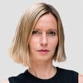

***
### Schwarz, Geraldine - 1974 - Francesa - Estrasburgo

Géraldine Schwarz (Estrasburgo, 1974) es una periodista y realizadora francoalemana. Colabora con diversos medios internacionales y en la actualidad realiza una investigación en los archivos de los servicios secretos federales de Alemania.
***