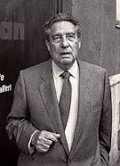

***
### Seethaler, Robert - 1966 - Austriaco - Viena

Robert Seethaler es un actor, guionista y escritor austriaco. Seethaler asistió a la escuela de teatro en su ciudad natal, Viena. Tras esto trabajó en varias producciones para cine y televisión, llegando a participar en la película Juventud de Paolo Sorrentino.

En Alemania tiene un gran éxito en su faceta literaria, habiendo conseguido el premio Buddenbrookhaus al autor novel con su primera novela Die Biene und der Kurt en el año 2007.

En 2014 publicó su gran éxito Una vida entera con el que ha conseguido el reconocimiento internacional y ha tenido un gran éxito tanto de público como de crítica; con esta obra ha conseguido el Premio Grimmelshausen 2015 y ha sido finalista del Man Booker International 2016 y el International Dublin Literary Award 2017.
***