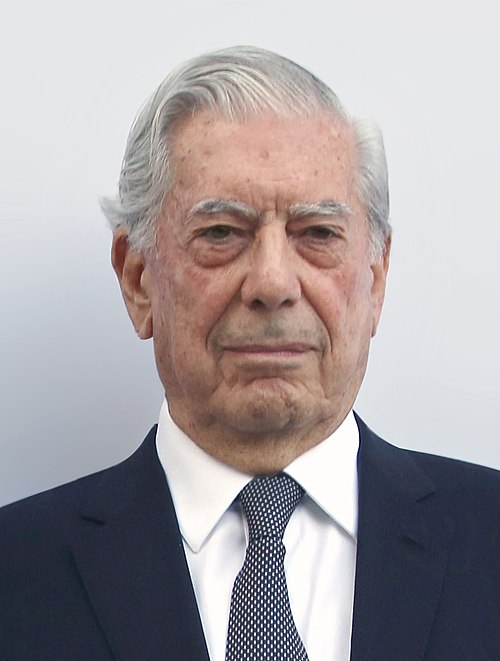

***
### Vargas Llosa, Mario - 1936 - Peruano - Arequipa        
                            
Jorge Mario Pedro Vargas Llosa, y marqués de Vargas Llosa, conocido como Mario Vargas Llosa, es un escritor peruano que cuenta también con la nacionalidad española desde 1993. Considerado uno de los más importantes novelistas y ensayistas contemporáneos, sus obras han cosechado numerosos premios, entre los que destacan el Nobel de Literatura 2010, el Cervantes (1994) —considerado como el más importante en lengua española—, el Premio Leopoldo Alas (1959), el Biblioteca Breve (1962), el Rómulo Gallegos (1967), el Príncipe de Asturias de las Letras (1986) y el Planeta (1993), entre otros. Desde 2011 recibe el tratamiento protocolar de Ilustrísimo señor al recibir de Juan Carlos I de España el título de marqués de Vargas Llosa.

Como escritor, alcanzó la fama en la década de 1960 con novelas como La ciudad y los perros (1962), La casa verde (1965) y Conversación en La Catedral (1969). Continuó escribiendo prolíficamente en varios géneros literarios, incluyendo la crítica literaria y el periodismo. Entre sus libros se encuentran obras de teatro, novelas policiacas, históricas y políticas. Varias de sus novelas, como Pantaleón y las visitadoras (1973) y La fiesta del Chivo (2000), han sido adaptadas y llevadas al cine. Muchas de las obras de Vargas Llosa están influidas por la percepción del escritor sobre la sociedad peruana y por sus propias experiencias como peruano; sin embargo, de forma creciente ha tratado temas de otras partes del mundo. Desde que inició su carrera literaria en 1958 reside en Europa (entre España, Gran Bretaña, Suiza y Francia) la mayor parte del tiempo, de modo que en su obra se percibe también una cierta influencia europea.

Al igual que otros autores hispanoamericanos, también ha participado en política. Luego de simpatizar con el comunismo en su juventud, a partir de la década de 1970 se adscribió al liberalismo. Fue candidato a la presidencia del Perú en las elecciones de 1990 por la coalición política de centroderecha Frente Democrático perdiendo la elección en segunda vuelta frente al candidato independiente Alberto Fujimori.
***
