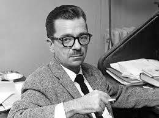

***
### Williams, John - 1922 - Estadounidense (Clarksville, Texas)
       
Nació en la pequeña localidad tejana de Clarksville, cerca del río Rojo. Después de desempeñar varios empleos en periódicos y emisoras de radio, Williams se enroló en el ejército en 1942, durante dos años y medio como sargento en la India y Birmania. Varios años después de la Segunda Guerra Mundial fue a la Universidad de Denver, donde obtuvo su título bachelor en 1949, y el master en 1950. Durante este periodo publicó su primera novela, Nothing But the Night (1948), y su primera colección de poemas, The Broken Landscape (1949). En otoño de 1950 Williams fue a la Universidad de Misuri, donde ejerció como profesor y obtuvo el doctorado en 1954. En 1955 pasó a dirigir el programa de escritura creativa de la Universidad de Denver.

La segunda novela en publicarse fue Butcher's Crossing (1960), seguida de English Renaissance Poetry (1963), una antología de poesía en inglés en la que Williams escribió la introducción. Su segundo libro de poemas, The Necessary Lie se publicó en 1965, año en el que se convirtió en editor de la revista literaria University of Denver Quarterly, hasta 1970. En 1965 también se publicó su tercera novela, Stoner, que fue reeditada por The New York Review of Books en los años 2000 y trata sobre la vida y la vocación de un profesor de literatura, por lo que contiene elementos autobiográficos. La más conocida de sus obras es su cuarta novela, Augustus, traducida al español como El hijo de César, ganadora del National Book Award de ficción en 1973.

Tras jubilarse de la Universidad de Denver en 1986, Williams se trasladó con su mujer a Fayetteville, Arkansas, hasta que murió de un fallo respiratorio el 3 de marzo de 1994. Una quinta novela, The Sleep Of Reason, quedó inacabada en el momento de su fallecimiento.
***