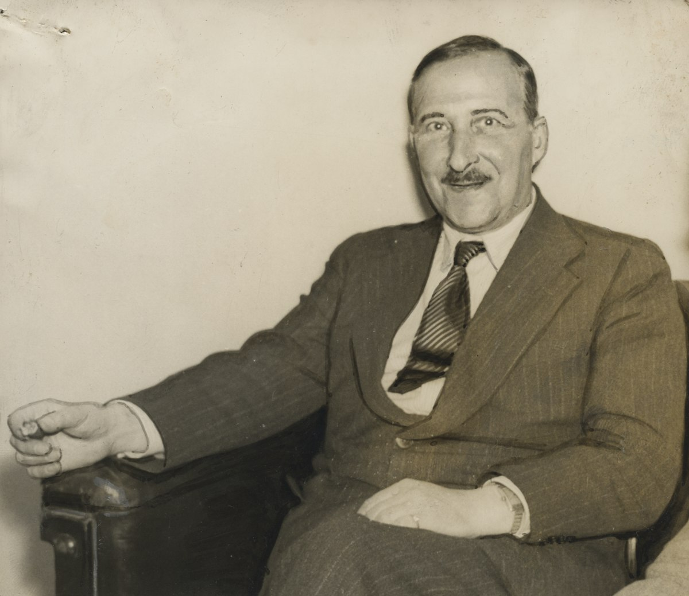

### Zweig, Stefan - 1957 - Austria-Hungría (Viena)
       
Nació en Viena, Austria-Hungría; 28 de noviembre de 1881 - Petrópolis, Murió en Brasil; 22 de febrero de 1942) 
Fue un escritor, biógrafo y activista social austríaco —posteriormente nacionalizado británico— judío de la primera mitad del siglo XX, sin parentesco con el escritor Arnold Zweig ni con la escritora alemana Stefanie Zweig (nacida en 1932).

Sus obras estuvieron entre las primeras que protestaron contra la intervención de Alemania en la Primera Guerra Mundial y fue muy popular entre la década de 1920 y 1930. Escribió novelas, relatos y biografías. De estas últimas, son particularmente conocidas las de María Estuardo y la de Fouché, una obra mitad biografía y mitad novela histórica. Otra de sus biografías, la dedicada a María Antonieta, fue adaptada al cine con el mismo título en 1938.

Zweig fue hijo de una familia judía acomodada. Su padre, Moritz Zweig, fue un acaudalado fabricante textil, y su madre, Ida Brettauer Zweig, hija de una familia de banqueros italianos.
Estudió en la Universidad de Viena, en la que obtuvo el título de doctor en Filosofía. También realizó cursos sobre Historia de la Literatura, que le permitieron codearse con la vanguardia cultural vienesa de la época. En ese ambiente, hacia 1901, publicó sus primeros poemas, una colección titulada Silberne Saiten (Cuerdas de plata), influida por Hugo von Hofmannsthal y Rainer Maria Rilke.
En 1904 apareció su primera novela, género de especial frecuencia en su carrera. Zweig desarrolló un estilo literario muy particular, que aunaba una cuidadosa construcción psicológica con una brillante técnica narrativa.
Además de sus propias creaciones en teatro, periodismo y ensayo, Zweig trabajó en traducciones de autores como Paul Verlaine, Charles Baudelaire y Émile Verhaeren.
Panorámica de la calle Stefan Zweig, Kapuzinerberg, Salzburgo, Austria.
En 1910 visitó la India y en 1912, América del Norte. En 1913 se estableció en Salzburgo, donde habría de vivir durante casi veinte años.
Durante la Primera Guerra Mundial, y luego de haber servido en el Ejército austrohúngaro por algún tiempo como empleado de la Oficina de Guerra, pues había sido declarado como no apto para el combate, se exilió a Zúrich (Suiza) gracias a sus convicciones antibelicistas influidas por Romain Rolland, entre otros.
De este período es Jeremías, obra antibélica que escribió mientras estaba en el ejército del Imperio Austrohúngaro, publicada durante su exilio en Suiza. Esta pieza teatral bíblica inspirada en la guerra europea fue exhibida en Nueva York hacia 1939.
***