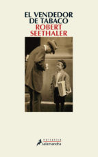

Conoce quién es [Seethaler, Robert] (../../Autores/SeethalerRobert/)

Título | Autor/a | Género | Editor | Traductor |
------ | ------- | ------ | ------ | --------- |
El vendedor de tabaco | Seethaler, Robert | Narrativa extranjera, novela contemporanea | Salamandra | Ana Guelbenzu |
***
|Sinopsis|
|--------|
Antes del éxito internacional de Toda una vida, Robert Seethaler había escrito El vendedor de tabaco. En la tradición de clásicos del género como Reencuentro, de Fred Uhlman, y El lector, de Bernhard Schlink, Seethaler nos sorprende una vez más con una novela sobre una serie de personas enfrentadas a los vaivenes de la historia, todo ello con la concisión y la elegancia que lo caracterizan. En agosto de 1937, el joven Franz Huchel abandona las idílicas montañas de Austria por las bulliciosas calles de Viena y el estanco de Otto Tresniek, un hombre benévolo pero algo mordaz. En el quiosco de Tresniek, donde se encuentran las clases populares y la burguesía judía de la Viena de los años treinta, Franz Huchel empezará su aprendizaje vital. Si bien la lectura asidua de la prensa y los rumores sobre el ascenso del nacionalsocialismo lo educan políticamente, su conocimiento de la vida sigue siendo insuficiente. Por eso, sin saber a quién pedir consejo sobre Anezka, la joven de la que está enamorado, Franz buscará el asesoramiento del «doctor de los locos», el mismísimo Sigmund Freud, cliente del estanco y gran fumador de puros, que vive a dos calles del puesto. Aunque viejo y cansado, el profesor cederá ante el tenaz interés mostrado por este jovial y curioso chico de pueblo. Pero los tiempos son inciertos y, en marzo de 1938, el Anschluss pondrá fin de forma brutal al aprendizaje de Franz y a su relación con el prestigioso doctor. Otto Tresniek, poco dispuesto a boicotear a su clientela judía, se convierte en la diana de la Gestapo. El humor vienés que desprenden Otto Tresniek y Sigmund Freud es la respuesta a la desesperación de una sociedad desorientada. En El vendedor de tabaco, Robert Seethaler confirma su enorme talento como escritor, capaz de emocionar con la sobriedad y la belleza de su prosa.
***