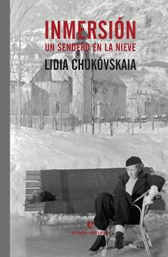

Título | Autor/a | Género | Editor | Traductor |
------ | ------- | ------ | ------ | --------- |
Inmersión (Un sendero en la nieve) | Chukovskaia, Lidia | Narrativa extranjera, Novela contemporánea | Errata naturae | Marta Rebón Rodríguez |
***
|Sinopsis|
|--------|
Esta bella historia, de gran simplicidad pero hondo calado, fue calificada por George Steiner como un clásico de la literatura rusa. Un documento excepcional sobre la vida en la Rusia estalinista.

«Si lograba llevar el cielo, la nieve y el aire a mi escritorio, la inmersión sería fácil, enseguida alcanzaría la claridad de visión adecuada».

Estamos en febrero de 1949. Nina Sergeievna, escritora y traductora, es uno de los privilegiados a los que la Unión de Escritores ha concedido un mes de descanso en el campo, lejos de la oscura y ominosa capital, Moscú. Oficialmente, se supone que debe descansar o trabajar en sus traducciones, pero lo que hace, en realidad, es reflexionar sobre la desaparición de su marido durante las persecuciones estalinistas de 1938, para liberarse así, al menos en parte, de su propia pesadilla. En una casa de campo finlandesa, en mitad de bellísimos paisajes nevados, Nina se sumerge en su historia mientras convive con otros traductores, autores o cineastas, más vinculados al régimen que ella.

Una novela a medio camino entre Anton Chéjov y Vasili Grossmann. Un texto bellísimo, de gran sencillez pero hondo calado, que George Steiner ha calificado como clásico de la literatura rusa del siglo XX.
***