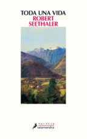

Conoce quién es [Seethaler, Robert] (../../Autores/SeethalerRobert/)

Título | Autor/a | Género | Editor | Traductor |
------ | ------- | ------ | ------ | --------- |
Toda una vida | Seethaler, Robert | Narrativa extranjera, novela contemporanea | Salamandra | Ana Guelbenzu |
***
|Sinopsis|
|--------|
La práctica totalidad de los seres humanos que han transitado por este mundo desde el inicio de los tiempos apenas han dejado huella alguna en los anales de la Historia. Sin embargo, hasta la persona más opaca e insignificante acumula en su existencia una suma casi infinita de vivencias estrictamente personales, instantes únicos que conforman una experiencia tan plena como la del más ilustre de los personajes. Esta excepcional novela —Libro del Año 2014 en Alemania, con casi un millón de ejemplares vendidos y traducido a treinta y tres idiomas—, es una invitación a compartir la vida de un hombre que, desde su total irrelevancia, proyecta un halo de vitalidad tan intenso como el del más brillante de los mortales.

A principios del siglo XX, llega a una pequeña aldea perdida en los Alpes el pequeño Andreas Egger, tras ser abandonado por su madre con apenas cuatro años. El niño crece sometido a la férrea disciplina de su tío, y su horizonte se agota en la cadena de enormes montañas que rodean el valle. Así, entre esas cimas de nieves perpetuas y esas paredes rocosas de fiereza salvaje que en su juventud laceraron su corazón con gélida impiedad, la vida de Andreas discurre entre la rudeza del entorno y una forzosa adaptación a los cambios que impone el progreso. Y aunque la construcción del teleférico y la irrupción del turismo de masas, con el consiguiente aluvión de excursionistas y esquiadores, desfiguran el microcosmos mudando las costumbres ancestrales, al final de sus días el octogenario Andreas permanece fiel a su naturaleza, contemplando una puesta de sol o bebiendo leche recién ordeñada con el mismo arrobo con que cincuenta años antes observaba embobado a la única mujer que le fue dado amar.

De una concisión y una pulcritud extremas, Toda una vida es una novela bellísima, una fábula sobre el sentido y el sinsentido de la existencia. Las pulsiones básicas del ser humano, la generosidad y el egoísmo, el amor y la muerte, son los pilares de un relato que fortalece el espíritu como un singular antídoto contra el desasosiego que invade al hombre moderno.
***