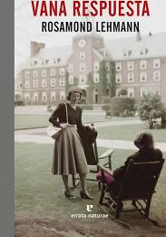

Título | Autor/a | Género | Editor | Traductor |
------ | ------- | ------ | ------ | --------- |
Vana respuesta | Lehmann, Rosamond | Narrativa | Errata Naturae | Regina López Muñoz |

**__Sinopsis__**

Vana respuesta narra la educación sentimental de Judith Earle —hija única de un padre académico y una madre perteneciente a la alta sociedad—, que vive recluida en una gran casa en el valle del Támesis. La mansión vecina está ocupada, esporádicamente, por la familia Fyfe, cinco primos que aparecen en la solitaria vida de la niña y adolescente Judith como figuras de un sueño: misteriosos y llenos de glamour. Más tarde, cuando Judith estudie en la Universidad de Cambridge, continuará en contacto con algunos de ellos y la amistad infantil se deslizará hacia los romances de juventud. Pero, entonces, una relación más importante —y escandalosa en aquella época— llegará a su vida…
Pocas páginas sobre la iniciación a la vida hemos leído como éstas. El territorio de la infancia es narrado aquí portentosamente, de un modo sobrio y muy elegante. La belleza de esos capítulos nos llevará a continuación a los sinsabores y tormentos de la adolescencia, y luego a la pasión de la juventud: no sólo leeremos a Judith, nos leeremos también a nosotros mismos.
Aunque ésta fue la primera novela de Rosamond Lehmann, posiblemente sea una de sus mejores obras. Y uno de los grandes textos de la narrativa british de los años veinte y treinta.
«Vana respuesta te absorberá por entero,  transformando tu vida íntima durante el tiempo en que la leas». Jonathan Coe
Enmarcada en la agitación sociocultural de los años 20 británicos, Vana respuesta apareció de manera fulgurante como la presentación oficial de una narradora fabulosa. En ella, Rosamond Lehmann presenta a la joven Judith Earle, a cuya piel se pega desde la más tierna infancia. En el primer tercio del libro, pues, la narración se sostiene alrededor de los años de descubrimiento de la joven Judith, que vive al amparo de una familia de alta sociedad y trata de expandir su círculo de amistades a través de sus cinco primos.