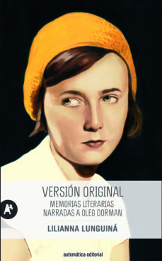

Conoce quién es [Lunguiná, Lilianna] (../../Autores/LunguinaLilianna/)

Título | Autor/a | Género | Editor | Traductor |
------ | ------- | ------ | ------ | --------- |
Versión original  | Lunguiná, Lilianna | Biografía | Automática | Yulia Dobrovolskaia y José María Muñoz Rovira |

|Sinopsis|
|--------|
Versión original. Memorias literarias narradas a Oleg Dorman, fue todo un acontecimiento editorial en Rusia, y constituye un documento único, la memoria de una época que nos permite adentrarnos en la cotidianidad de la vida bajo el régimen soviético, con sus luces y sus sombras, al tiempo que una magnífica narración, cargada de inteligencia y sabiduría, que repasa una vida extraordinaria. Lilianna Lunguiná nació en 1920 en Rusia, en el seno de una familia de origen judío, y vivió una despreocupada infancia entre Francia, Palestina y Alemania. Sin embargo, cuando tenía trece años sus padres decidieron retornar a la Unión Soviética y la llegada a ese nuevo mundo cambió su vida para siempre. Lunguiná será testigo privilegiado de los vaivenes de un régimen que, presa de una paranoia creciente, se revolverá contra sí mismo iniciando brutales purgas y persecuciones; la joven, que pronto empezará a relacionarse con círculos intelectuales, verá a muchos de sus amigos cercanos y conocidos caer en desgracia y acabar condenados al ostracismo laboral e intelectual, cuando no enviados directamente a los campos de trabajo. Los interrogatorios del KGB, el exilio al inicio de la Segunda Guerra Mundial o el antisemitismo que comienza a impregnar la sociedad soviética serán duras pruebas para una mujer que, con el paso del tiempo, se convertirá en una de las traductoras más respetadas de la escena literaria rusa (dando voz a auMe llamo Lilia Lunguiná. Desde los cinco hasta los diez años, mientras viví en Alemania, me llamaban Líli Márkovich. Luego, entre los diez y los catorce, en Francia, me llamaban Lilí Markovích. Y cuando actuaba en las representaciones del teatro de marionetas de mi madre, era Lili Imali. Imali era el nombre artístico de mi madre, una palabra del hebreo antiguo que significa «mi madre». Así que he tenido muchos nombres. Y también muchas escuelas. Fui alumna —una vez las conté— de doce escuelas. Pero esta larga vida —el 16 de junio (de 1997) cumplo setenta y siete, da miedo incluso pensarlo, jamás creí que pudiera llegar a esta edad— no ha sido suficiente para aprender a presentarme con mi patronímico. Debe de ser un rasgo propio de nuestra generación, nos sentíamos jóvenes durante largo tiempo, nos llamábamos por los nombres de pila sin más, nos tuteábamos.

No obstante, setenta y siete años son muchos y ya toca hacer balance. Y no un balance provisional, como tituló la última parte de su libro mi marido Sima, sino uno definitivo. Aunque, por otro lado, ¿cómo hacer balance de una vocación? ¿Cuál sería el balance de una vida? Creo que el balance de una vida es la vida misma. La suma total de todos los instantes vividos, felices, difíciles, desgraciados, deslumbrantes y oscuros; todo el conjunto de los minutos, horas y días; la esencia, digamos, de la vida, ese es el balance, no hay otra cosa que pueda resumir una vida. Por eso ahora me apetece recordar. Y mirar las viejas fotografías.

Recuerdo muy bien el momento en el que por primera vez comprendí que yo soy yo, es decir, que soy una unidad particular con respecto al resto del mundo.

Guardo una fotografía en la que estoy sentada sobre las rodillas de mi padre, la imagen reproduce ese momento preciso. Quería mucho a mi padre, me mimaba muchísimo; hasta aquel instante yo me había sentido parte inseparable de él, del mundo entero, y de pronto fue como contraponerme a él, a todo lo que había alrededor. Supongo que esa fue mi toma de consciencia, la comprensión de que soy una individualidad, de que poseo una personalidad. Hasta ese momento, crecía sin más, digamos, siguiendo el programa genético, conforme a lo que me fue concedido desde el nacimiento. En cambio, desde aquel momento, en cuanto adquirí consciencia de mi contraposición al mundo, este empezó a influirme. Y lo que había en mí poco a poco comenzó a modificarse, a labrarse, a pulirse bajo el influjo del mundo exterior, de la grandeza de la vida que había a mi alrededor. Dicho de otra manera, en mi experiencia, en aquello que vivía, en las situaciones en las que me encontraba, en las elecciones que hacía, en las relaciones que surgían con la gente, en todo ello se sentía cada vez más la presencia del mundo que bullía en torno a mí. Por eso he pensado que al relatar mi vida no hablo de mí, no tanto de mí… Porque de entrada la propuesta me ha parecido absurda: ¿a santo de qué voy a hablar de mí? No me considero, por ejemplo, más inteligente que los demás…, y en general, no entiendo por qué debería hablar de mí misma. Pero de mí como de un organismo que incluyó, absorbió, elementos de la vida exterior, de la compleja, contradictoria vida del mundo circundante, así tal vez cabría intentarlo. Y es que en este caso se perfila la experiencia de otra vida, de la vida en grande, pasada por el filtro individual, es decir, de algo objetivo. Y siendo objetivo, tal vez resulte valioso.

La verdad es que a veces pienso que ahora, a finales del siglo, con tanta división y tantos bandazos por doquier, cuando nuestro país rueda hacia quién sabe dónde, la sensación es que se precipita a marchas forzadas hacia un abismo, por lo que quizás valga la pena salvaguardar el máximo de vestigios del pasado, de la vida que hemos vivido: del siglo xx e incluso, a través de los padres, del xix. Tal vez cuanta más gente deje testimonio de aquella experiencia, más se logre salvar y finalmente pueda armarse con aquellos fragmentos un cuadro más o menos completo de una época a pesar de todo humanitaria, de una vida con rostro humano, como se dice ahora. Esto aportaría algo, serviría de alguna manera de ayuda al siglo xxi. Me refiero, claro está, a la suma de testimonios; el mío ni siquiera es una gota, sino una centésima parte de una gota. De pronto siento el deseo de participar como sea en esa gota. De esa manera sí que puedo intentar relatar algo de mí, de lo que he vivido y de cómo lo he vivido.

Si, como dicen (bueno, yo, en cualquier caso, así lo creo), una obra artística, un libro, una película, debe transmitir un mensaje —y, probablemente, un testimonio también tendría que comunicar algo—, me gustaría formular mi «mensaje» ahora mismo. Antes que nada, quisiera subrayar que se ha de tener esperanza y creer, que incluso las peores situaciones pueden mostrar inesperadamente su otra cara y conducir a algo bueno. Les mostraré cómo en mi vida y más tarde en la nuestra, la que compartimos mi marido Sima y yo, muchas desgracias se volvían una suerte increíble, una riqueza, trataré de enfatizarlo para recordarnos que no podemos rendirnos a la desesperación. Porque sé cuánta desesperación habita actualmente en las almas. En definitiva, que hay que creer, hay que tener esperanza, y con el tiempo muchas cosas pueden desvelar que, en realidad, tienen un signo distinto del que aparentan.Me llamo Lilia Lunguiná. Desde los cinco hasta los diez años, mientras viví en Alemania, me llamaban Líli Márkovich. Luego, entre los diez y los catorce, en Francia, me llamaban Lilí Markovích. Y cuando actuaba en las representaciones del teatro de marionetas de mi madre, era Lili Imali. Imali era el nombre artístico de mi madre, una palabra del hebreo antiguo que significa «mi madre». Así que he tenido muchos nombres. Y también muchas escuelas. Fui alumna —una vez las conté— de doce escuelas. Pero esta larga vida —el 16 de junio (de 1997) cumplo setenta y siete, da miedo incluso pensarlo, jamás creí que pudiera llegar a esta edad— no ha sido suficiente para aprender a presentarme con mi patronímico. Debe de ser un rasgo propio de nuestra generación, nos sentíamos jóvenes durante largo tiempo, nos llamábamos por los nombres de pila sin más, nos tuteábamos.

No obstante, setenta y siete años son muchos y ya toca hacer balance. Y no un balance provisional, como tituló la última parte de su libro mi marido Sima, sino uno definitivo. Aunque, por otro lado, ¿cómo hacer balance de una vocación? ¿Cuál sería el balance de una vida? Creo que el balance de una vida es la vida misma. La suma total de todos los instantes vividos, felices, difíciles, desgraciados, deslumbrantes y oscuros; todo el conjunto de los minutos, horas y días; la esencia, digamos, de la vida, ese es el balance, no hay otra cosa que pueda resumir una vida. Por eso ahora me apetece recordar. Y mirar las viejas fotografías.

Recuerdo muy bien el momento en el que por primera vez comprendí que yo soy yo, es decir, que soy una unidad particular con respecto al resto del mundo.

Guardo una fotografía en la que estoy sentada sobre las rodillas de mi padre, la imagen reproduce ese momento preciso. Quería mucho a mi padre, me mimaba muchísimo; hasta aquel instante yo me había sentido parte inseparable de él, del mundo entero, y de pronto fue como contraponerme a él, a todo lo que había alrededor. Supongo que esa fue mi toma de consciencia, la comprensión de que soy una individualidad, de que poseo una personalidad. Hasta ese momento, crecía sin más, digamos, siguiendo el programa genético, conforme a lo que me fue concedido desde el nacimiento. En cambio, desde aquel momento, en cuanto adquirí consciencia de mi contraposición al mundo, este empezó a influirme. Y lo que había en mí poco a poco comenzó a modificarse, a labrarse, a pulirse bajo el influjo del mundo exterior, de la grandeza de la vida que había a mi alrededor. Dicho de otra manera, en mi experiencia, en aquello que vivía, en las situaciones en las que me encontraba, en las elecciones que hacía, en las relaciones que surgían con la gente, en todo ello se sentía cada vez más la presencia del mundo que bullía en torno a mí. Por eso he pensado que al relatar mi vida no hablo de mí, no tanto de mí… Porque de entrada la propuesta me ha parecido absurda: ¿a santo de qué voy a hablar de mí? No me considero, por ejemplo, más inteligente que los demás…, y en general, no entiendo por qué debería hablar de mí misma. Pero de mí como de un organismo que incluyó, absorbió, elementos de la vida exterior, de la compleja, contradictoria vida del mundo circundante, así tal vez cabría intentarlo. Y es que en este caso se perfila la experiencia de otra vida, de la vida en grande, pasada por el filtro individual, es decir, de algo objetivo. Y siendo objetivo, tal vez resulte valioso.

La verdad es que a veces pienso que ahora, a finales del siglo, con tanta división y tantos bandazos por doquier, cuando nuestro país rueda hacia quién sabe dónde, la sensación es que se precipita a marchas forzadas hacia un abismo, por lo que quizás valga la pena salvaguardar el máximo de vestigios del pasado, de la vida que hemos vivido: del siglo xx e incluso, a través de los padres, del xix. Tal vez cuanta más gente deje testimonio de aquella experiencia, más se logre salvar y finalmente pueda armarse con aquellos fragmentos un cuadro más o menos completo de una época a pesar de todo humanitaria, de una vida con rostro humano, como se dice ahora. Esto aportaría algo, serviría de alguna manera de ayuda al siglo xxi. Me refiero, claro está, a la suma de testimonios; el mío ni siquiera es una gota, sino una centésima parte de una gota. De pronto siento el deseo de participar como sea en esa gota. De esa manera sí que puedo intentar relatar algo de mí, de lo que he vivido y de cómo lo he vivido.

Si, como dicen (bueno, yo, en cualquier caso, así lo creo), una obra artística, un libro, una película, debe transmitir un mensaje —y, probablemente, un testimonio también tendría que comunicar algo—, me gustaría formular mi «mensaje» ahora mismo. Antes que nada, quisiera subrayar que se ha de tener esperanza y creer, que incluso las peores situaciones pueden mostrar inesperadamente su otra cara y conducir a algo bueno. Les mostraré cómo en mi vida y más tarde en la nuestra, la que compartimos mi marido Sima y yo, muchas desgracias se volvían una suerte increíble, una riqueza, trataré de enfatizarlo para recordarnos que no podemos rendirnos a la desesperación. Porque sé cuánta desesperación habita actualmente en las almas. En definitiva, que hay que creer, hay que tener esperanza, y con el tiempo muchas cosas pueden desvelar que, en realidad, tienen un signo distinto del que aparentan.tores como Knut Hamsun, August Strindberg, Henrik Ibsen, Boris Vian o Astrid Lindgren) y en pieza clave de la intelligentsia: en contacto con Pasternak, Brodsky y Solzhenitsyn, entre muchas otras figuras de la literatura rusa del s.xx. 
***