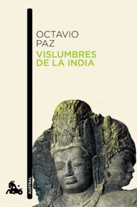

---
title: Vislumbres de La India
subTitle: Paz, Octavio
category: "Recomendado"
cover: Vislumbres-de-la-India.jpg
---Conoce quién es [Paz, Octavio] (../../Autores/PazOctavio/)

Título | Autor/a | Género | Editor | Traductor |
------ | ------- | ------ | ------ | --------- |
Vislumbres de La India | Paz, Octavio | Literatura de viajes | Seix Barral | Original en castellano |

|Sinopsis|
|--------|
Si en La llama doble (1993) Paz había atendido a la relación entre amor y erotismo y a su significado último, en Vislumbres de la India llevó a cabo una recapitulación no solo de su periodo de residencia continuada en dicha nación ―ante la que fue embajador desde 1962 hasta 1968― y sus viajes anteriores y posteriores a ella, sino también de la huella cultural, artística, política y filosófica que la India ha dejado en su vivencia, y, más allá o más acá de ello, un examen de qué cosa sea en sí la India.
Una India vivida en cuanto experiencia personal, en los reveladores capítulos autobiográficos que abren y cierran el volumen; una India, por otro lado, examinada en su - complejidad nacional, religiosa e histórica. Testimonio de la agudeza analítica de Paz, Vislumbres de la India supone además un reto para el lector occidental: al ampliar nuestro horizonte mediante la presentación de una realidad tan distinta como la del inmenso país, nos incita también a ahondar en la fértil discrepancia entre nuestra visión del mundo y las que ahí imperan, a trazar analogías o a perfilar contrastes que, al subvertir nuestra rutina, pueden acaso permitirnos ver en nuestro entorno fecundas posibilidades latentes. El diálogo con la India es así, en la lúcida y diáfana prosa de Octavio Paz, también un diálogo con la condición humana, también un diálogo con nosotros mismos.
Este libro es el reflejo de la huella cultural, artística, política y filosófica que la India dejó en Octavio Paz (embajador desde 1962 hasta 1968); una India vivida en cuanto experiencia personal, en los reveladores capítulos autobiográficos que abren y cierran el volumen; una India, por otro lado, examinada en su complejidad nacional, religiosa e histórica. El libro nos permite ampliar nuestro horizonte mediante la presentación de una realidad tan distinta, nos incita a ahondar en la fértil discrepancia entre nuestra visión del mundo y las que ahí imperan, a trazar analogías o a perfilar contrastes que, al alterar nuestra rutina, pueden permitirnos ver en nuestro entorno fecundas posibilidades latentes.
***