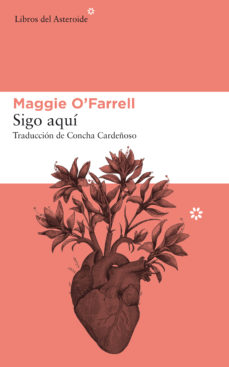

Título | Autor/a | Género | Editor | Traductor |
------ | ------- | ------ | ------ | --------- |
Sigo aquí | O'Farrel, Maggie | Narrativa | Asteroide | Concha Cardeñoso |
***
|Sinopsis|
|--------|
Un parto se complica más allá de lo razonable; a una niña le diagnostican una enfermedad incurable que la tiene encamada durante más de un año; una adolescente es agredida por un extraño mientras pasea por el campo; el avión en el que una joven viaja a Asia se precipita al vacío; una mujer se salva por los pelos de ser atropellada.
Estos son algunos de los episodios –sucedidos en distintos momentos de su vida y en diversos países– que Maggie O’Farrell recoge en este particularísimo libro autobiográfico. Diecisiete roces con la muerte, como los llama su autora, que pudieron terminar en desastre, diecisiete momentos clave de su vida que revelan una manera de ser y estar en el mundo. Sigo aquí es un libro sincero que huyendo de lo sentimental anima al lector a interrogarse sobre las cosas que verdaderamente cuentan, a reflexionar sobre la fragilidad de nuestra existencia y a celebrar la belleza y el milagro de la vida.
«Todo el mundo debería leerlo (…) Puedo contar con los dedos de una mano los libros que me han hecho llorar, Sigo aquí es uno de ellos.» Claire Kilroy (The Irish Times)
«Nunca había leído un libro sobre la muerte que me haya hecho sentirme tan viva. Una lectura adictiva que te para el corazón.» Tracy Chevalier
«Un recordatorio estremecedor y penetrante de cuán cerca estamos de lo que podría haber pasado pero no pasó.» Dani Shapiro (The New York Times)
***