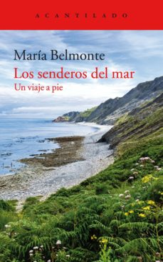

Conoce quién es [Belmonte, María] (../Autores/BelmonteMaría/)

**__Seleccionado para el club del 14/5/2019__**

Título | Autor/a | Género | Editor | Traductor |
------ | ------- | ------ | ------ | --------- |
Los enderos del mar | Belmonte, María | Ensayo y viajes | Acantilado | Original en castellano|
***
|Sinopsis|
|--------|
Acompañada de Aristóteles, Goethe, Victor Hugo, Darwin, Jane Austen y tantos otros escritores, pintores o aventureros, la autora nos invita a realizar una travesía por la costa vasca. Un viaje sentimental a los lugares de la adolescencia se transforma en una exploración de los viejos caminos costeros, un recorrido por la historia humana y geológica, grabada de un modo particularmente revelador en los paisajes y las piedras de la costa, el primigenio umbral donde se encuentran dos mundos. Un texto inspirador que nos propone observar la naturaleza y deleitarnos en ella, contemplar los matices de la vida en estado puro y sentir su hondo latido.
***