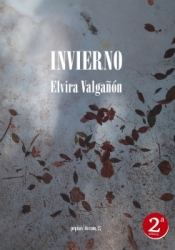

Conoce quién es [Valgañon, Elvira] (../Autores/ValganonElvira/)

**__Seleccionado para el club del 14/5/2019__**

Título | Autor/a | Género | Editor | Traductor |
------ | ------- | ------ | ------ | --------- |
Invierno | Valgañon, Elvira | Novela contemporánea | Pepitas de calabaza | Original en castellano|
***
|Sinopsis|
|--------|
A las puertas del invierno de 1809, un soldado escapa de las filas del ejército napoleónico porque no fue a la guerra para matar civiles. El desertor, moribundo, es acogido en un pequeño pueblo de la sierra hasta que… Vidas y secretos, pasiones calladas y esperanzas ciegas se cruzan durante más de un siglo y medio en las calles y los prados de ese pequeño pueblo sin otra magia (a pesar de la casa encantada o de un espantapájaros que trata de comprender el mundo) que la vida; un lugar, casas, plazas, bosques, cielo, cuevas, donde el aire huele a nieve y a cristales de escarcha, donde siempre son largos los inviernos.

Niños que sueñan, ancianos que no quieren olvidar, hombres y mujeres que soportan unos días en los que todo parece invierno. Pero no todo es lo que parece, porque en esta novela, suma de historias que se mezclan como las hojas de las hayas caídas sobre un sendero, Elvira Valgañón deja entrever que la belleza y piedad son los mejores recursos para hacer de la vida y de la literatura un lugar habitable.

Una obra emocionante de una escritora detallista y esencial, atenta a los sonidos y los silencios de las palabras. Una escritora, Elvira Valgañón, que está aún por descubrir por el gran público, y cuya novela nos sentimos particularmente orgullosos de publicar.
***