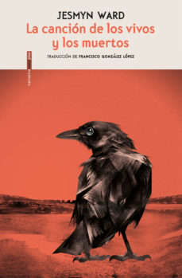

Conoce quién es [Ward, Jesmyn] (../Autores/WardJesmyn/)

**__Seleccionado para el club del 14/5/2019__**

Título | Autor/a | Género | Editor | Traductor |
------ | ------- | ------ | ------ | --------- |
La canción de los vivos y los muertos | Ward, Jesmyn | Novela contemporánea | Sexto piso | Francisco González López|
***
|Sinopsis|
|--------|
La novela ganadora del National Book Award 2017 que se ha convertido en un fenómeno literario para los lectores y la crítica, que la citó como una de las novelas del año.
Una novela que la crítica ha comparado con William Faulkner, Flannery O’Connor o Toni Morrison. Jojo, de trece años, y su hermana menor Kayla viven con sus abuelos negros en una granja en la costa del Golfo de Misisipi, con la compañía siempre esporádica de su madre, Leonie, una mujer que desearía ser mejor madre de lo que es. Cuando el padre de ambos, un hombre blanco, va a salir de prisión –Parchman Farm, la misma penitenciaría en la que el abuelo de Jojo cumplió una condena injusta durante su juventud–, Leonie insiste en ir a recogerlo con los niños. Durante el azaroso viaje, Jojo, Kayla y Leonie deberán aprender a relacionarse como familia, y Jojo conocerá a Richie, otro niño con quien descubrirá el legado de la esclavitud y la importancia de reconciliarse con el pasado.
***