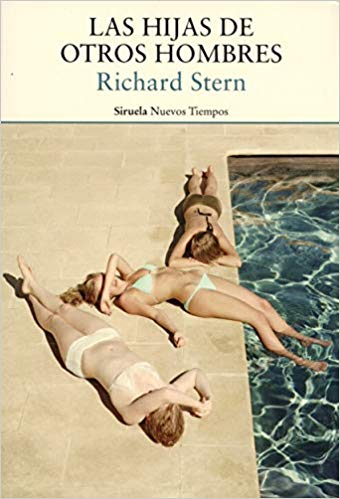

Conoce quién es [Stern, Richard] (../Autores/SternRichard/)

**__Seleccionado para el club del 13/6/2019__**

Título | Autor/a | Género | Editor | Traductor |
------ | ------- | ------ | ------ | --------- |
Las hijas de otros hombres | Stern, Richard | Narrativa | Siruela | Laura Salas |

|Sinopsis|
|--------|
A su feliz pequeña escala, Las hijas de otros hombres fue a la década de los sesenta lo que El gran Gatsby a los años veinte o Las uvas de la ira a los treinta. Hay mucho que admirar en ella: la precisión, el tacto, la humanidad del sentimiento, su tremendo encanto... Es como si Chéjov hubiese escrito Lolita». Philip Roth «Hasta el día en que el señor Merriwether se marchó de casa ;un mes después de su divorcio;, los Merriwether parecían una familia serena e ideal». Estamos en verano, a finales de la década de 1960. Las calles de Cambridge, Massachusetts, están llenas de hippies de pelo largo y coloridas prendas, pero el doctor Robert Merriwether, que enseña en Harvard y lleva mucho tiempo casado, no repara lo más mínimo en toda esa vida bullendo a su alrededor. Cultivado, reflexivo, animal de costumbres... Merriwether es todo menos un hombre impulsivo. Por eso es tan extraño, tan deslumbrante e inesperado, que mientras su esposa Sarah está de vacaciones conozca a Cynthia Ryder, y que en poco tiempo profesor y alumna empiecen un intenso romance. La novela de Richard Stern ;discreto clásico moderno de la literatura norteamericana; es un elegante examen de la pasión amorosa, de su epicentro y sus réplicas, de sus devastadoras consecuencias. «Amor», piensa el doctor Merriwether. «Cuántos millares de sentimientos escondía aquella palabra famosa y petrificada, el origen de tanta historia y desorden.
***