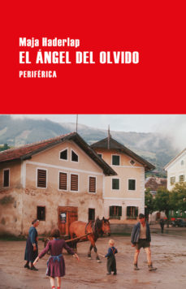

Título | Autor/a | Género | Editor | Traductor |
------ | ------- | ------ | ------ | --------- |
El ángel del olvido | Haderlap, Maja | Narrativa autores extranjeros | Periférica |  José Aníbal Campos |

|Sinopsis|
|--------|
«Una historia llena de fuerza.» Peter Turrini, News

«Una gran novela.» Georg Pichler, Die Presse

«El ángel del olvido nos habla de un dolor que se extiende hasta el presente.» Christoph Schröder, Süddeutsche Zeitung

«El testimonio de una época, un documento de enorme fuerza poética. Una pesquisa que se adentra en los abismos de la Historia y que aún atenaza a los implicados.» Paul Jandl, Die Welt

«El ángel del olvido es un “glaciar sereno” que arrastra a su paso todo lo que a la joven protagonista le parece prodigioso e irreversible.» Wolfgang Höbel, Der Spiegel

«Un texto evocador sobre la memoria, la idea de comunidad y el sufrimiento.» Kirkus Reviews
***
En estos tiempos nuestros en los que el olvido se impone en lo individual a través de numerosas patologías que, por conveniencia ajena a quienes las sufren y por tanto no cuentan, se incluyen en un mismo saco, contribuyendo así a borrar las diferencias, las vidas y las circunstancias de quienes olvidan, y contribuyendo, en definitiva, a borrar (a emborronar) a las personas afectadas y a sus familias, resulta extraña la idea de un “ángel del olvido”. En estos tiempos, insisto, en que las reivindicaciones de memoria histórica son acalladas bajo la sombra de banderas engañosamente unificadoras; mientras unos muertos descansan en mausoleos hechos de sangre y otros en cunetas o en tierras de labor sin señal de su existencia, parece una contradicción pensar en el olvido como un ángel. Sin embargo, basta leer las primeras páginas de esta magnífica novela para entender que se trata de una historia que no busca el olvido, sino el sitio para esas personas trabajadoras, sencillas, “de a pie”, que la Historia (la grande, la oficial) ningunea, obvia, olvida.

El ángel del olvido narra en primera persona, a través de la voz de una niña que pasará a ser joven y se convertirá finalmente en una adulta independiente (tal vez la voz de la autora), la historia de una familia (su familia), de un pueblo, de un grupo de la minoría eslovena de Carintia (sur de Austria), tras la Segunda Guerra Mundial. Y en el contar desde el asombro de la niñez, el inconformismo de la juventud, la reflexión de la adultez, en ese contar, siempre, desde la observación minuciosa, afloran en la novela problemáticas como el horror de la guerra, las muertes sin sentido, las delaciones, la orfandad repentina, los enfrentamientos familiares, la huida a los montes de los partisanos, el infierno de los campos de concentración, la locura, la enfermedad, la muerte; la historia de “los nadies” que diría Galeano, y mucho más.

Mucho más porque Maja Haderlap no se centra en los horrores de la guerra, sino en la sombra que ésta deja sobre quienes la padecen. Una sombra que ennegrece los sueños, que impulsa huidas imposibles, que trampea con el alcohol como bálsamo, que cambia las líneas de las fronteras y las lenguas de la población; que se refleja en suicidios, recelos y miedos. Una sombra alargada que llega, incluso, a quienes no vivieron la guerra y se ven obligados, como nuestra protagonista, a cargar un pasado que no es el suyo y a aceptar un futuro con una mácula perenne. Mucho más porque El ángel del olvido nos pone delante la vida, con todos sus placeres y sinsabores, en la voz de una niña que crece, que pelea con su cuerpo, que siente miedo, que quiere querer y quiere, que quiere aprender y aprende, pero que nunca alcanzará el olvido. Una voz que nos cuenta el mundo, su mundo, con palabras y expresiones llenas de belleza, que leemos sintiendo que son las auténticas gracias a la impresionante traducción de José Aníbal Campos.

En definitiva, en El ángel del olvido, Maja Haderlap nos escribe la vida, y lo hace peleando con su lengua y admitiendo la necesidad de la escritura. Lo hace desde la razón, y desde las vísceras.

Lean esta novela, por favor. Cuando lo hagan hablamos.
***