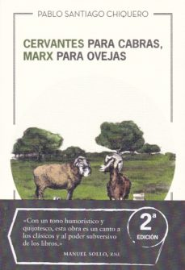

Conoce quién es [Chiquero, Pablo Santiago] (../Autores/ChiqueroPabloSantiago/)

Título | Autor/a | Género | Editor | Traductor |
------ | ------- | ------ | ------ | --------- |
Cervantes para cabras, Marx para ovejas | Chiquero, Pablo Santiago | Narrativa española. Novela contemporanea | MACLEIN & PARKER |  Original en castellano |

|Sinopsis|
|--------|
Con lucidez y humor, con una resolución casi quijotesca, esta novela plantea la posibilidad de una metamorfosis completa de la sociedad, a través del cambio de visión del mundo que conlleva el conocimiento. Más que una comedia rural, más que una historia de amor, amistad y aprendizaje, Cervantes para cabras, Marx para ovejas es una fábula sobre el amor a los libros, la fe ciega en los clásicos y el poder transformador de la lectura, una actividad subversiva capaz de transfigurar para siempre la realidad en la que vivimos. 
***
