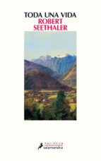
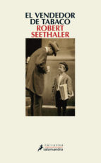

Conoce quién es [Seethaler, Robert] (../Autores/SeethalerRobert/)

Ambos del autor Robert Seethaler
La fecha es provisional.
El libro estápendiente de selección entre los siguientes dos títulos:

TODA UNA VIDA
=============
a práctica totalidad de los seres humanos que han transitado por este mundo desde el inicio de los tiempos apenas han dejado huella alguna en los anales de la Historia. Sin embargo, hasta la persona más opaca e insignificante acumula en su existencia una suma casi infinita de vivencias estrictamente personales, instantes únicos que conforman una experiencia tan plena como la del más ilustre de los personajes. Esta excepcional novela —Libro del Año 2014 en Alemania, con casi un millón de ejemplares vendidos y traducido a treinta y tres idiomas—, es una invitación a compartir la vida de un hombre que, desde su total irrelevancia, proyecta un halo de vitalidad tan intenso como el del más brillante de los mortales.

A principios del siglo XX, llega a una pequeña aldea perdida en los Alpes el pequeño Andreas Egger, tras ser abandonado por su madre con apenas cuatro años. El niño crece sometido a la férrea disciplina de su tío, y su horizonte se agota en la cadena de enormes montañas que rodean el valle. Así, entre esas cimas de nieves perpetuas y esas paredes rocosas de fiereza salvaje que en su juventud laceraron su corazón con gélida impiedad, la vida de Andreas discurre entre la rudeza del entorno y una forzosa adaptación a los cambios que impone el progreso. Y aunque la construcción del teleférico y la irrupción del turismo de masas, con el consiguiente aluvión de excursionistas y esquiadores, desfiguran el microcosmos mudando las costumbres ancestrales, al final de sus días el octogenario Andreas permanece fiel a su naturaleza, contemplando una puesta de sol o bebiendo leche recién ordeñada con el mismo arrobo con que cincuenta años antes observaba embobado a la única mujer que le fue dado amar.

De una concisión y una pulcritud extremas, Toda una vida es una novela bellísima, una fábula sobre el sentido y el sinsentido de la existencia. Las pulsiones básicas del ser humano, la generosidad y el egoísmo, el amor y la muerte, son los pilares de un relato que fortalece el espíritu como un singular antídoto contra el desasosiego que invade al hombre moderno.

EL VENDEDOR DE TABACO
=====================
En esta exquisita novela, Robert Seethaler —autor de la exitosa Toda una vida, publicada en más de treinta idiomas— ha creado, con su concisión y elegancia características, un encaje literario magníficamente resuelto en el cual un personaje histórico relevante como Sigmund Freud interactúa con el protagonista para conducirnos desde la insólita relación entre dos hombres dispares hasta sumergirnos poco a poco en el creciente clima de temor y opresión imperante en la Viena de los años treinta, un período que marcó de forma crucial el devenir de la Historia europea. 

A finales del verano de 1937, el joven Franz Huchel abandona el «agujero lluvioso» de su Attersee natal para buscarse la vida en Viena, donde encuentra trabajo en un puesto de venta de diarios y tabaco en el que confluyen las clases populares y la burguesía judía, un lugar idóneo para satisfacer su deseo de comprender una realidad subyugante. Así pues, si bien la lectura asidua de la prensa despierta su educación política, el momento mágico llega cuando queda torpemente prendado de Anezka, una chica tan luminosa como esquiva, reticente a ofrecerle a Franz esa experiencia que tanto anhela. Sumido en la desesperación, el joven recurre al «médico de los locos», el mismísimo Sigmund Freud, comprador habitual del puesto y empedernido fumador de puros. Aunque viejo y cansado, el profesor cederá ante la tenacidad de este impulsivo y curioso chico de pueblo. Pero los tiempos son inciertos y, en marzo de 1938, el temido Anschluss, la anexión de Austria como una provincia del Tercer Reich, segará de forma brutal el aprendizaje de Franz y su relación con el prestigioso doctor.

El uso brillante y dosificado del humor como instrumento terapéutico de una sociedad angustiada ante un futuro amenazante confirma el portentoso talento de Robert Seethaler, que no deja de seducirnos y emocionarnos con la sobriedad y la belleza de su prosa.
***
