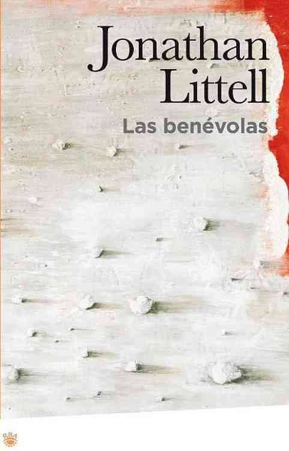

Conoce quién es [Littell, Jonathan] (../Autores/LittellJonathan/)

Título | Autor/a | Género | Editor | Traductor |
------ | ------- | ------ | ------ | --------- |
Las venévolas | Littell, Jonathan | Ficción histórica | Pendiente | Pendiente |

|Sinopsis|
|--------|
Las benévolas (Les Bienveillantes) es una novela de ficción histórica escrita en francés por el estadounidense Jonathan Littell. Narra la vida de un ex oficial de las SS alemanas que colaboró a llevar a cabo matanzas durante el Holocausto. El libro ha sido galardonado con dos de los más prestigiosos premios literarios franceses: el Grand Prix du roman de l’Académie française y el Prix Goncourt el 2006. Las Benévolas es la primera novela escrita en francés por Jonathan Littell, que ya había publicado con anterioridad un libro de ciencia ficción titulado Bad Voltage, en 1989.

El título Las Benévolas hace referencia a la trilogía de la Antigua Grecia Orestíada, escrita por Esquilo. Las Erinias o Euménides (del griego antiguo Εύμενίδες, ‘benévolas’), llamadas más tarde Furias por la mitología latina, eran la personificación femenina de la venganza, diosas que perseguían y atormentaban a aquellos que asesinaban a un progenitor. En las tragedias de Esquilo, Orestes, que mató a su madre Clitemnestra para vengar el asesinato de su padre Agamenón, es perseguido por estas criaturas. La diosa Atenea interviene instaurando un tribunal para juzgar el caso de las Furias contra Orestes. Éste sale absuelto, y Atenea logra que las Erinias acepten el veredicto y que se transformen en las más amadas de los Dioses, y que muestren y compartan justa misericordia y gratitud. Las Furias aceptan el pacto y adoptan el nombre de Benévolas.

Cuando se le preguntó el motivo que le impulsó a escribir un libro como Las Benévolas, Jonathan Littell evoca una foto paralizadora que descubrió en 1989 de una partisana soviética, Zoya Kosmodemyanskaya, que fue ahorcada por los nazis.1 Según él mismo añade, vio en 1992 la película Shoah de Claude Lanzmann, de la cual le causó especial impresión el aspecto burocrático del proceso del genocidio que expone Raul Hilberg. En 2001, decidió abandonar su trabajo en 'Action Against Hunger' y empezar una investigación que duró dieciocho meses, y que le llevaría por Alemania, el Cáucaso, Ucrania, Rúsia y Holanda. Leyó cerca de doscientos libros sobre la Alemania nazi, el Frente del Este, los Juicios de Núremberg y el proceso del genocidio.1 Además, Littell estudió la literatura y las películas de archivo de la Segunda Guerra Mundial y de los juicios posteriores al fin de ésta. El autor trabajó en la novela durante cinco años.

El escritor dice que quiso centrarse en el pensamiento de un asesino y en los orígenes del democidio o asesinato de Estado, mostrando en la novela cómo podemos tomar decisiones que conduzcan, o no, a un genocidio.4 Littell también explica que sentó las bases del protagonista Max Aue, imaginando cómo se habría comportado él mismo si hubiera nacido en la Alemania nazi.5 Otro aspecto que mantuvo a Littell interesado en estos mismos aspectos fue la guerra de Vietnam cuando era niño. Según él mismo dijo: “Mi terror de infancia era ser seleccionado para ser enviado a Vietnam y que me hicieran matar mujeres y niños que no me habían hecho nada a mí.
***
El libro es una autobiografía ficticia que describe la vida de Maximilian Aue, un ex oficial de las SS que décadas después narra la historia de una parte crucial de su vida: cuando fue un miembro activo de las fuerzas del Tercer Reich. En la novela, Aue acepta su responsabilidad por su participación en las masacres de judíos, pero la mayor parte del tiempo se siente más un observador que un participante.

|Estructura|
|--------|
Las Benévolas está dividido en siete capítulos, cada uno con el nombre de una danza barroca, siguiendo la secuencia de la Suite de Bach. La narrativa de cada capítulo está influida por el ritmo de cada danza.

«Tocata» En este primer capítulo, el narrador es introducido al lector y le descubre cómo terminó en Francia. Es el director de una fábrica de encaje, tiene mujer, hijos y nietos, a pesar de que no mantiene un afecto real hacia ellos y sigue con sus encuentros homosexuales en los viajes de negocios. Habla de un amor incestuoso que más tarde sabremos que dirige hacia su hermana gemela. Explica que se ha decidido a escribir acerca de sus experiencias durante la guerra por su propio beneficio y no como intento de justificarse a sí mismo, e insiste en que se cogió a tantos hombres buenos como malos para formar las SS. Cierra la introducción diciendo: “Vivo, hago lo que es factible, hago lo que hace todo el mundo, soy un hombre como los demás, soy un hombre como vosotros. ¡Venga, si os digo que soy como vosotros!”

«Alemandas I y II»  Aue describe su vida como miembro de uno de las escuadras de asesinato de los Einsatzgruppen en Ucrania, concretamente en Crimea, y en el Cáucaso. Describe con detalle las masacres de judíos y bolcheviques tras las líneas del frente (una de las descritas es la de Babi Yar en Kiev, el 1941). A pesar de que parece que su indiferencia hacia las atrocidades que presencia va en aumento, comienza a experimentar vómitos diarios y sufre una crisis nerviosa. Al retornar de su baja por enfermedad, descubre que un oficial superior ha decidido transferirlo a Stalingrado el 1942.

«Courante» Aue toma parte en los últimos días de la batalla de Stalingrado. Como antes, él es un soldado observador, el escritor del reportaje más que un combatiente. En medio del caos, violencia y hambre más absoluta, logra mantener una conversación con un comisario político ruso sobre las similitudes entre el nazismo y el punto de vista de los bolcheviques, dando pie a que el narrador vuelva a indicar su apoyo intelectual a la causa nazi. Aue es gravemente herido en la cabeza y evacuado de modo milagroso justo antes de la rendición alemana en febrero de 1943.

«Zarabanda» Durante su convalecencia en Berlín, el mismo Heinrich Himmler le concede la Cruz de Hierro de 1a Clase por su heroica acción en Stalingrado. Aún en baja por enfermedad, decide visitar a su madre y su padrastro en Antibes, en la Francia ocupada por Italia. Según cuenta él mismo, ambos son brutalmente asesinados mientras él duerme profundamente. Aue se va de la casa sin dar noticia del crimen a nadie y vuelve a Berlín.

«Minueto (en rondós)» Aue es transferido al Ministerio Federal del Interior comandado por Himmler, donde se ocupa de tareas relativas a la gestión y burocracia en los campos de concentración, luchando por mejorar las condiciones de vida de esos prisioneros seleccionados para trabajar en fábricas con el fin de aumentar la productividad. El lector se encuentra a los más altos burócratas nazis organizando la implantación de la Solución Final al “problema judío” (por ejemplo, Adolf Eichmann, Himmler o Rudolf Höß) y se da una visión del campo de concentración de Auschwitz. El protagonista también pasa un tiempo en Budapest en el momento en que se están realizando los preparativos para transportar judíos húngaros a Auschwitz. El lector es testigo de la guerra interna entre aquellos preocupados por la producción de la guerra, como el arquitecto Albert Speer, y aquellos que tratan endemoniadamente de implantar la Solución Final. Durante este período, dos policías de la Kripo, oficiales de las SS que investigan el asesinato de la madre y el padrastro de Aue comienzan a visitarlo de forma regular, atormentándolo con preguntas que no dejan lugar a dudas sobre la sospecha de la participación de Aue en el caso.

«Aire» Aue visita la casa vacía de su hermana en Pomerania y se sume en sus fantasías eróticas con su hermana gemela. Los dos policías de la Kripo siguen su ruta hasta la casa, pero Aue se las arregla para esconderse de ellos.

«Giga» El protagonista vuelve a Berlín entre las líneas del frente soviético con su amigo Thomas, que ha ido hasta Pomerania a rescatarlo. En la capital alemana se encuentra a una gran mayoría de sus compañeros preparándose para escapar en el caos de los últimos días del Tercer Reich. Conoce a Hitler en su búnker y es condecorado por el mismo Führer. Huye por los túneles subterráneos del U-Bahn de Berlín, donde vuelve a coincidir con los policías que lo persiguen por su posible implicación en el doble asesinato. Aunque el caso ha sido desestimado varias veces por el juez, los policías no son capaces de aceptar la derrota y se preparan para ejecutar a Aue. La tormenta de rusos en los túneles acaba con la vida de uno de los policías y con Aue huido. En el zoo de Berlín se produce el último encuentro entre el protagonista y el segundo policía, pero Thomas, amigo de Aue, acaba con el policía y acto seguido Aue mata a Thomas y se queda con los papeles y el uniforme del trabajador francés por el que Thomas quería hacerse pasar para huir a Francia, a sabiendas de que su alto cargo en las SS habría sido suficiente para ser ejecutado cuando lo atraparan. Aunque no se explicita al final del relato, desde el principio de la novela el lector sabe que el multilingüismo de Aue le permitirá pasar la frontera francesa con su nueva identidad y vivir allí otra vida.
***