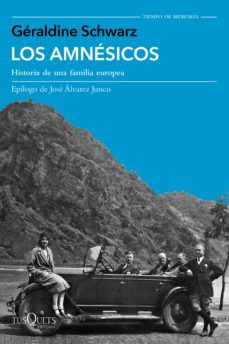

Conoce quién es [Schwarz, Geraldine] (../Autores/SchwarzGeraldine/)

**__Seleccionado para el club del (Pendiente de fecha__**

Título | Autor/a | Género | Editor | Traductor |
------ | ------- | ------ | ------ | --------- |
Los amnésicos | Schwarz, Geraldine | Historia. Segunda Guerra Mundial | Tusquets | Núria Viver Barri |
***
|Sinopsis|
|--------|
Una fascinante historia familiar entreverada con la historia reciente de Europa. Un apasionante documento sobre el auge de los populismos y los peligros de la desmemoria histórica.
En la ciudad alemana de Mannheim, de donde es originario su padre, Géraldine Schwarz descubre que su abuelo Karl compró en 1938, a muy bajo precio, una empresa a sus propietarios judíos, los Löbmman, más tarde asesinados en Auschwitz. Tras la guerra, confrontado con un heredero que reclama una reparación, Karl Schwarz opta por la negación de sus responsabilidades como Mitläufer, es decir, aquellos que, como la mayoría de alemanes, «se dejaron llevar por la corriente». Así arranca una apasionante investigación que cubre tres generaciones de la historia reciente de Europa y que nos obliga a reflexionar sobre los riesgos de la desmemoria y el auge del neofascismo en nuestro continente.
***