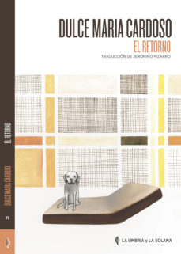

Conoce quién es [Cardoso Dulce María] (../Autores/CardosoDulceMaria/)

**__Seleccionado para el club del 6 de febrero de 2020**

Título | Autor/a | Género | Editor | Traductor |
------ | ------- | ------ | ------ | --------- |
El retorno | Cardoso Dulce María | Narrativa extranjera. Novela contemporánea | La Umbría y la Solana | Jrónimo Pizarro |
***
|Sinopsis|
|--------|
“Angola acabó. Nuestra Angola acabó”. Esta frase se encuentra a unas cuantas páginas del inicio de ‘El retorno’, la novela de la escritora portuguesa Dulce Maria Cardoso traducida al español por Jerónimo Pizarro. Quien habla es Rui, un adolescente que debe abandonar Angola y migrar con su familia hacia Portugal. Sus padres nacieron en la metrópoli portuguesa, y este es su único destino posible ante el cisma que recorre las calles de Luanda: la revolución comunista que empezó en Europa y extendió los ánimos emancipatorios hasta las colonias en África. Los blancos ya no son bienvenidos.

La realidad por fuera del clima emocional entre los miembros de la familia de Rui son datos a cuenta gotas disgregados a lo largo del texto. Lo que se nos revela con intensidad en un primer momento es el drama de tener que decidir entre las cosas que se quedan y las que se van. La apuesta de Dulce Maria es por una memoria sensible e íntima y, sin embargo, común a los cientos de miles de portugueses que sufrieron el desalojo, entre los que se cuenta la propia autora.

En la novela, parte de la familia emigra a la metrópoli con la expectativa de que lo nuevo signifique una vida mejor. Pero esa esperanza muere aún antes de que el avión despegue del aeropuerto atestado de gente que huye de los disparos. En ese momento Rui todavía cuenta la historia con la sabiduría de la inocencia: es capaz de observar lo que pasa y al narrarlo lo deja en evidencia. Por un lado están los sentimientos: el miedo, la incertidumbre y el terror, y por otro lo que pasa afuera, especialmente la violencia racial, la segregación y la injusticia.

A medida que el libro avanza, Rui crece. Ya no es el niño que abandonó Angola pensando en los aretes de cerezas de las muchachas de la metrópoli. Ahora vive en una habitación de hotel, teme por la salud de su madre y planea estrategias para salvar a los suyos del destino desgraciado que amenaza a la mayoría de retornados.

Jerónimo Pizarro cuenta en la introducción el sorprendente método de escritura de Dulce Maria: hace varias versiones de cada uno de sus libros para después deshacerse de ellas y liberar la prosa al vaivén del recuerdo. Lo que leemos es una reminiscencia de la historia escrita con el impulso de lo que está en riesgo de ser olvidado. El ritmo es incesante, como una respiración, y la puntuación responde a esa vista de vértigo. Algo similar ocurre con los tiempos verbales: el narrador empieza a contar las historias con el frenesí propio del testigo y al párrafo siguiente ya son parte del pasado.

En el corazón de la espera de la familia de Rui, agudizado por la novedad del invierno, late un gran acontecimiento. Y lo hace al lado de una serie de descubrimientos relacionados con la identidad, el amor, la libertad y el arrojo de quienes lo han perdido casi todo, excepto la ambición de un milagro.

Por este relato -su cuarta novela-, Dulce Maria Cardoso recibió en 2011 el Premio Especial de la Crítica en Portugal. Además, Francia la condecoró como Caballero de la Orden de las Artes y las Letras en 2012.
***
