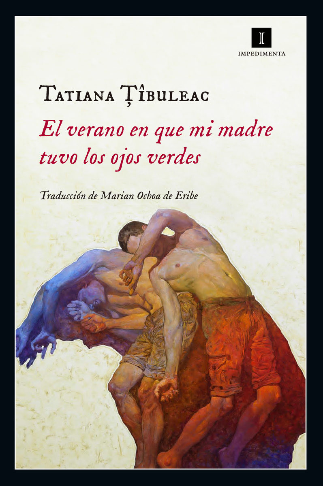

Conoce quién es [Tibuleac, Tatiana] (../Autores/TibuleacTatiana/)

**__Seleccionado para el club del 5 de marzo de 2020**

Título | Autor/a | Género | Editor | Traductor |
------ | ------- | ------ | ------ | --------- |
El verano en que madre tuvo los ojos verdes | Tibuleac, Tatiana | Narrativa extranjera. Novela contemporánea | Impedimenta | Marian Ochoa de Eribe |
***
|Sinopsis|
|--------|
Aleksy aún recuerda el último verano que pasó con su madre. Han transcurrido muchos años desde entonces, pero, cuando su psiquiatra le recomienda revivir esa época como posible remedio al bloqueo artístico que está sufriendo como pintor, Aleksy no tarda en sumergirse en su memoria y vuelve a verse sacudido por las emociones que lo asediaron cuando llegaron a aquel pueblecito vacacional francés: el rencor, la tristeza, la rabia. ¿Cómo superar la desaparición de su hermana? ¿Cómo perdonar a la madre que lo rechazó? ¿Cómo enfrentarse a la enfermedad que la está consumiendo? Este es el relato de un verano de reconciliación, de tres meses en los que madre e hijo por fin bajan las armas, espoleados por la llegada de lo inevitable y por la necesidad de hacer las paces entre sí y consigo mismos. Plena de emoción y crudeza, TatianaŢîbuleac muestra una intensísima fuerza narrativa en este brutal testimonio que conjuga el resentimiento, la impotencia y la fragilidad de las relaciones maternofiliales. Una poderosa novela que entrelaza la vida y la muerte en una apelación al amor y al perdón. Uno de los grandes descubrimientos de la literatura europea actual.
***
