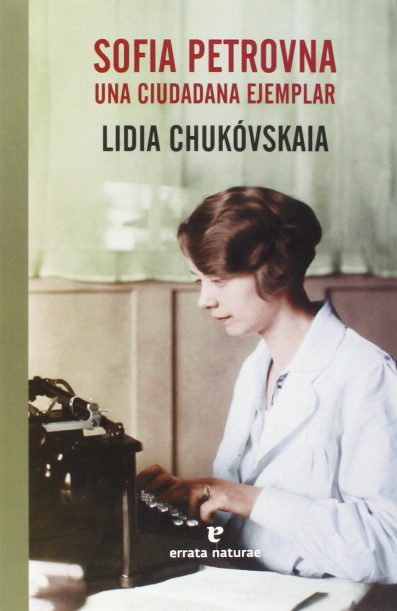

Conoce quién es [Chukovskaia, Lidia] (../../Autores/ChukovskaiaLidia/)

Título | Autor/a | Género | Editor | Traductor |
------ | ------- | ------ | ------ | --------- |
Sofía Petrovna | Chukovskaia, Lidia | Ficción histórica | Errata Naturae | Marta Rebón |

|Sinopsis|
|--------|
Sofia Petrovna, viuda de un prestigioso médico, trabaja como mecanógrafa en una de las más importantes editoriales de Leningrado. Parece que la vida y el Estado le sonríen a pesar de las continuas estrecheces: el resto de las mecanógrafas de la oficina está bajo su eficaz batuta; su sueldo es cada vez mayor; su propio hijo ha dejado de ser un muchacho para convertirse, al fin, en un joven y guapo ingeniero también ejemplar: ama la herencia de la Revolución y el Partido casi tanto como a su madre, a quien alienta en su dedicación y empeño. Estamos a mediados de los años treinta, y enseguida —en medio de un misterio que quizá nadie consiga resolver nunca— el vértigo innombrable de la Gran Purga va a arrastrar hasta el centro de su vacío a Kolia, el hijo. Comenzará entonces una «segunda» y ejemplar, en el sentido cervantino del término, novela: un verdadero aprendizaje sobre la vida y sus sinrazones, una parábola a la vez ingrata e insuperable; es decir, una pieza literaria de primer orden. O, como suele decirse, un texto que nos muestra la otra cara de la verdad, ésa que muchas veces inventamos nosotros mismos para no perder toda esperanza. Sofia Petrovna fue redactada en secreto en un cuaderno escolar durante el invierno de 1939-1940. Como señaló la propia autora, «mi obra se escribió con la huella de los acontecimientos aún fresca en mi mente». Lidia Chukóvskaia combatió el miedo con palabras, el silencio con el testimonio, la colectivización con la historia individual, la indiferencia ante el dolor de los demás con la empatía para con el sufrimiento ajeno, el heroísmo tradicionalmente de corte masculino con el espacio íntimo femenino. Poniendo en riesgo su vida, llenó de realidad la ficción para hacer que el futuro lector de este libro único y necesario supiera del pasado, de modo que la memoria de lo acontecido se mantuviera siempre viva. «Su obra es tan significativa como Un día en la vida de Iván Denísovich de Solzhenitsyn». Times Literary Supplement «Resulta profundamente conmovedora precisamente por su narración calmada, su sencillez y su sinceridad». Neue Zürcher Zeitung «Un document humain de una fuerza emocionante y conmovedora». Süddeutsche Zeitung «Un clásico que tiene la ventaja y la fuerza de convicción de la inmediatez». Welt der Literatur
***
