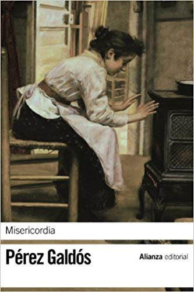

Conoce quién es [Pérez galdos, Benito] (../Autores/PerezGaldosBenito/)

Título | Autor/a | Género | Editor | Traducción |
------ | ------- | ------ | ------ | --------- |
Misericordia | Pérez galdos, Benito | Novela contemporánea | Varias ediciones | En castellano en el original |
***
|Sinopsis|
|--------|
El Madrid galdosiano, escenario esencial y común a gran parte de las novelas ejemplares de Galdós, es en Misericordia un espacio físico y emocional que se desmorona.​ De entre sus ruinas, el escritor va rescatando con cariño —casi página a página— una interminable lista de supervivientes: burgueses miserables como doña Paca y sus hijos (Obdulia y Antoñito) salvados de la indigencia más penosa por una herencia casi surreal, y frente a ellos, en un halo de gloria, miserables mendigos, ciegos que saben ver y criadas cercanas a la santidad.
***¿Qué dice Benito Pérez Galdós?***
"En Misericordia me propuse descender a las capas ínfimas de la sociedad matritense, describiendo y presentando los tipos más humildes, la suma pobreza, la mendicidad profesional, la vagancia viciosa, la miseria, dolorosa casi siempre, en algunos casos picaresca o criminal y merecedora de corrección. Para esto hube de emplear largos meses en observaciones y estudios directos del natural, visitando las guaridas de gente mísera o maleante que se alberga en los populosos barrios del sur de Madrid. Acompañado de policías escudriñé las "casas de dormir" de las calles de Mediodía Grande y del Bastero, y para penetrar en las repugnantes viviendas donde celebran sus ritos nauseabundos los más rebajados prosélitos de Baco y Venus, tuve que disfrazarme de médico de la Higiene municipal. No me bastaba esto para observar los espectáculos más tristes de la degradación humana, y solicitando la amistad de algunos administradores de las casas que aquí llamamos "de corredor", donde hacinadas viven las familias del proletariado ínfimo, pude ver de cerca la pobreza honrada y los más desolados episodios del dolor y la abnegación en las capitales populosas..."
***
