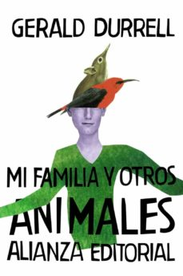

Conoce quién es [Durrell, Gerald] (../Autores/DurrellGerald/)

Título | Autor/a | Género | Editor | Traducción |
------ | ------- | ------ | ------ | --------- |
Mi familia y otros animales | Durrell, Gerald | Narrativa extranjera | Varias ediciones | María Luisa Balseiro |
***
|Sinopsis|
|--------|
Gerald Durrell combina en sus libros el retrato de gentes y lugares, la autobiografía y un insuperable sentido del humor. Mi familia y otros animales es sin duda su obra más conocida y celebrada. Primera parte de su divertida trilogía de Corfú, que prosigue con Bichos y demás parientes y El jardín de los dioses, la obra nos presenta una ágil y graciosa galería de personajes, como Larry -Lawrence Durrel, el futuro autor del Cuarteto de Alejandría- y sus estrafalarias amistades, mamá Durrell y su inagotable sentido común, o Spiro, el corfuano angloparlante, junto con toda una serie de animales retratados como sólo puede hacerlo quien a lo largo de toda una vida los ha considerado con inteligencia y ternura.
***
