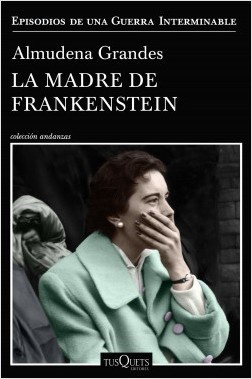

Conoce quién es [Grandes, Almudena] (../Autores/GrandesAlmudena/)

Título | Autor/a | Género | Editor | Traductor |
------ | ------- | ------ | ------ | --------- |
La madre de Frankenstein | Grandes, Almudena | Novela literaria | General narrativa literaria | Tusquets Editores | Original en castellano |
***
|Sinopsis|
|--------|
En 1954, el joven psiquiatra Germán Velázquez vuelve a España para trabajar en el manicomio de mujeres de Ciempozuelos, al sur de Madrid. Tras salir al exilio en 1939, ha vivido quince años en Suiza, acogido por la familia del doctor Goldstein. En Ciempozuelos, Germán se reencuentra con Aurora Rodríguez Carballeira, una parricida paranoica, inteligentísima, que le fascinó a los trece años, y conoce a una auxiliar de enfermería, María Castejón, a la que doña Aurora enseñó a leer y a escribir cuando era una niña. Germán, atraído por María, no entiende el rechazo de ésta, y sospecha que su vida esconde muchos secretos. El lector descubrirá su origen modesto como nieta del jardinero del manicomio, sus años de criada en Madrid, su desdichada historia de amor, a la par que los motivos por los que Germán ha regresado a España. Almas gemelas que quieren huir de sus respectivos pasados, Germán y María quieren darse una oportunidad, pero viven en un país humillado, donde los pecados se convierten en delitos, y el puritanismo, la moral oficial, encubre todo tipo de abusos y atropellos.
***
