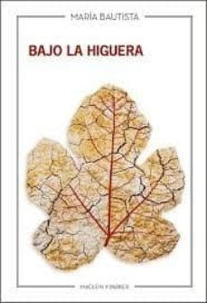

Conoce quién es [Bautista, María] (../Autores/BautistaMaria/)

Título | Autor/a | Género | Editor | Traducción |
------ | ------- | ------ | ------ | --------- |
Bajo la higuera | Bautista, María | Narrativa española | Maclein y Parker | En castellano en el original |
***
|Sinopsis|
|--------|
Bajo la higuera es una novela acerca de la maternidad, pero desde el punto de vista de las mujeres que nunca quisieron ser madres, aunque de muy diferentes formas acabaron siéndolo. Con el mundo rural de la España vacía como telón de fondo, encontramos a dos mujeres que intentan reconciliarse con ellas mismas y aceptar las consecuencias de sus propias decisiones. La convivencia y las tardes de ganchillo bajo la higuera cambiarán la percepción que ambas mujeres tienen sobre la otra, estableciendo una conexión que va más allá de los lazos familiares.

Clara vuelve de Berlín después de diez años, con una maleta llena de dolor y culpa. Volver al hogar resulta casi imposible: su madre ya no está y sus amistades sobreviven a la crisis y a la vida adulta. Sin perspectivas y sin trabajo, decide enfrentarse a su pasado y recuperar la ilusión de un futuro mudándose a un pequeño pueblo de Salamanca para cuidar de su abuela Inés, de noventa y tres años. En una casa donde rondan los fantasmas de la vieja, malhumorada y huraña, Clara descubrirá una historia que, como la suya propia, está atravesada por las muertes ajenas y por secretos que, tarde o temprano, acabarán por salir a la luz.
***
