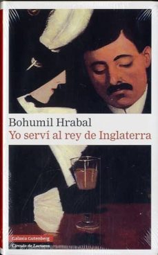

Conoce quién es [Hrabal, Bohumil] (../Autores/HrabalBohumil/)

Título | Autor/a | Género | Editor | Traducción |
------ | ------- | ------ | ------ | --------- |
Yo serví al rey de Inglaterra | Hrabal, Bohumil | Narrativa extranjera | Galaxia Gutemberg | Monika Zgustova |
***
|Sinopsis|
|--------|
En la década de 1930, en Praga, un joven aprendiz de camarero, Jan, logra su primer trabajo dispuesto a convertirse en dueño de un hotel e ingresar en el selecto club de los millonarios. Listo y ambicioso, todo lo supeditará a alcanzar el éxito y el reconocimiento social. Pero el punto de vista de Jan es a menudo equivocado: se casa con una alemana que adora a Hitler justo cuando las tropas nazis entran en Praga, y se convierte en millonario justo cuando en su país se implanta el comunismo. Con un brillante sentido del humor y escenas hilarantes, Hrabal nos cuenta las picarescas peripecias del joven camarero quien, como el buen soldado Švejk, pone en evidencia el absurdo de la vida cotidiana y de los personajes con los que se encuentra. Como Švejk, la aparente idiotez de Jan esconde una aguda inteligencia que le permite sobrevivir a los acontecimientos históricos más dramáticos del siglo xx: la invasión nazi de su país, la Segunda Guerra Mundial y la llegada del comunismo. Comedia y melancolía, ambición y resignación, se mezclan en esta novela inolvidable coronada con un bellísimo final. Como ha dicho de Hrabal su traductora y biógrafa, Monika Zgustova, «ninguno de sus lectores puede resistirse a la magia de su narración en primera persona y al atractivo de sus personajes inauditos, estrafalarios, originales, esos quijotes de la cotidianidad». Con la publicación de esta nueva traducción de Yo serví al rey de Inglaterra, Galaxia Gutenberg inicia la recuperación en español de las mejores obras de Bohumil Hrabal, considerado por Milan Kundera como el mejor escritor checo contemporáneo.
***
