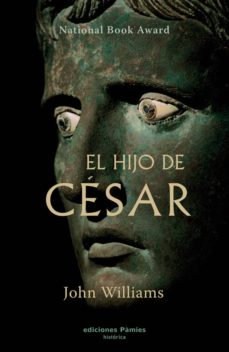

Conoce quién es [Williams, John] (../Autores/WilliamsJohn/)

Título | Autor/a | Género | Editor | Traducción |
------ | ------- | ------ | ------ | --------- |
El hijo del cesar | Williams, John | Narrativa histórica | Ediciones Pámies | Christine Monteleone |
***
|Sinopsis|
|--------|
Año 44 a.C. Tras varias décadas salpicadas por las guerras civiles y las purgas políticas la figura de Julio César se alza como dictador, amo indiscutible de una República romana que ya únicamente lo es de nombre. En la cumbre de su poder, cuando comienza su gran reforma de Roma, 23 puñaladas siegan su vida en uno de los magnicidios más famosos e inútiles de la historia. Inútil, porque un asesinato que pretendía salvar a la República aupó al poder al hombre que le daría definitivo carpetazo. Sonrisas escépticas y suspiros de alivio se mezclaron cuando el testamento de César fue abierto y en él aparecía como heredero su sobrino-nieto Octavio, un muchachito enclenque y enfermizo que cambiará tres veces de nombre y con el último, Augusto, llegará a ser el hombre más poderoso del mundo.

En este punto exacto es donde comienza la narración de El hijo de César, que tratará tres etapas fundamentales identificadas con la vida del heredero. En la primera, Octavio debe defender la herencia recibida y se embarca en una mar de intrigas políticas y de empresas militares encaminadas a honrar los esfuerzos de César. Tras acordar un triunvirato y vencer en una guerra civil, al igual que su tío, Octavio es el hombre fuerte de Roma. La segunda parte narra la consolidación del Imperio y las luchas por el poder, la conformación de un nuevo orden que tendrá vigencia durante casi 500 años. Ahora es Augusto nuestro protagonista, un hombre cuya autoridad no es cuestionada en público pero que debe andarse con cuidado para no tener el mismo fin que su predecesor, pues las conjuras proliferan y la lucha sucesoria, especie lamente dentro de su propia casa, es encarnizada. El final corresponde por fin al propio Augusto, en los últimos días de su vida. Aunque de nuevo se use el formato epistolar, el texto se va convirtiendo paulatinamente en un diario íntimo, en un repaso a la propia vida en el que el viejo emperador valora sus aciertos y desaciertos, la función de su vida y rememora el pasado, consciente de que no le queda futuro ya.

El hijo de César, nace, después de una meticulosa labor de investigación, de la pluma de un auténtico poeta como John Williams, y nos cuenta el sueño de un hombre por liberar a la corrupta Roma de las guerras intestinas que amenazaban con acabar con ella y afianzarla como eje del mundo.
***
